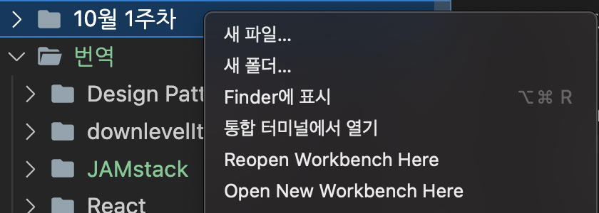

## 📌 쓸만한 extension 발견

monorepo 폴더에서 사용하면 괜찮을 것 같은 extension을 발견했다. monorepo는 root 폴더에서 npm i를 한다음 특정 패키지로 이동해야 할때 command + O를 눌러서 경로를 찾아 이동한다.

그런데 'Open Folder Context Menus for VS Code'라는 extension을 사용하면 아래와 같이 폴더에서 오른쪽 클릭을 했을 때 새로운 workbench에서 열것이냐(Open New Workbench Here), 아니면 현재 workbench가 해당 폴더로 이동할 것이냐(Reopen Workbench Here)에 대한 선택을 할수있게되어, 경로를 일일히 찾아들어가지 않아도 된다.

---

## 📌 4200 포트 대체 정체가... 🤮

최근에 Nx를 이용해서 monorepo를 셋업했다. Nx에서 nextjs의 로컬 서버 기본 포트 번호가 4200번이다. 그리고 네이버 로그인 API를 발급받는데, 서비스 URL과 Callback URL 설정시 포트번호가 4200번이면 아래와 같은 화면이 보여지게된다.

구글링하면 URL을수정하라고 하는데, 문제가 URL의 포트 번호라는 것을 알기까지는 상당히 오랜 시간이 걸렸다. 그니까 4200 포트 번호를 3000 포트 번호로 바꾸게 되면 정상적인 화면이 보여지게 된다. 대체 무슨 상황인지 🤯

---

## 📌 Y2K Bug

UTC와 GMT에 대한 공부를 하다가 Y2K Bug에 대해서 궁금해서 찾아봤다. 밀레니엄 버그라고도 불리우는데, 년도에 대한 정보를 저장할때 맨 뒤 두자리만 저장하여 발생하는 버그를 의미한다고 한다. 가령 1962년이라고 한다면 년도에 대해서 62라는 숫자만 저장하게 되는데, 이 경우, 2000년이 됐을 때 컴퓨터는 1900년으로 해석하게 된다는 의미이다 -\_-; 하필 2000년이 다가오고 있을 때 이 문제에 대해서 인식하기 시작했다고 하는데, 별거 아닌 것 같아 보이지만, 은행, 운송, 발전소등과 같이 하루 혹은 년 단위로 동작하는 프로그래밍 된 작업들은 큰 문제가 된다고 한다. 문제 해결을 위해서 기존 2자리의 데이터를 모두 4자리로 확장했다고 한다.

[Y2K Bug](https://education.nationalgeographic.org/resource/Y2K-bug)

---

## 📌 Time Stamp, Unix Time, Epoch Time

이 역시도 UTC와 GMT에 대해서 공부하다가 궁금하여 조사하게 되었다.

### 1. Time Stamp

파일이나 로그에 등록된 시간으로, 파일이나 로그가 생성, 삭제, 수정, 전송된 시간이 기록된다.

### 2. Unix Time

특정 날짜(Epoch Time) 이후부터 카운팅한 초의 합(total second)를 의미한다. 일반적인 시간 형식(YYYY-MM-DD hh:mm:ss 등)이 아닌, 단순한 single number를 저장함으로써 저장 공간을 효율적으로 사용할 수 있게된다. 현대의 경우 차이가 크지 않을 수 있지만, 저장 공간이 훨씬 작은 1960년 후반 유닉스를 생각해본다면 이야기가 달라진다.

천재가 아닌 이상 머릿속으로 초의 합을 일반적인 시간 형식으로 바꾸는 것은 불가능하다는 단점이 있지만, Wed, 21 Oct 2015 07:28:00 GMT와 같은 일반적인 시간 형식과 비교했을 때, 두개의 Unix Time Stamp가 있을 때 시간적인 선후를 구분하기 쉽고, 두 Time Stamp간 차이를 구하는 것 역시도 쉽다는 장점이 있다.

### 3. Epoch Time

Unix Time이 특정 날짜 이후부터 카운팅한 초의 합이라고 설명했다. 여기서 특정 날짜는 언제일까? 바로 1970년 1월 1일 00시 00분 00초 UTC 시간을 의미하며 이를 Epoch Time 혹은 Unix Epoch라고 부른다. 참고로 Epoch는 (중요한 사건, 변화들이 일어난) 시대를 의미한다.

프로그래머들이 1970년 1월 1일 00시 00분 00초 UTC를 Epoch Time으로 선정한 이유는 Unix Time이 만들어진 날짜와 가장 가까운 날짜라고 한다.

[Time Stamp](https://www.computerhope.com/jargon/t/timestam.htm)

[What Is Unix Time and When Was the Unix Epoch?](https://www.makeuseof.com/what-is-unix-time-and-when-was-the-unix-epoch/)

