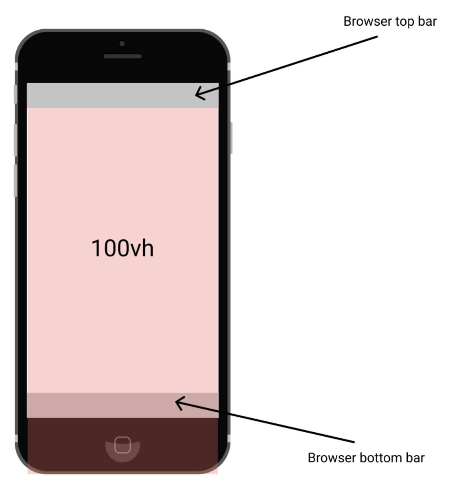

나를 포함한 웹뷰 개발 경험이 전무한 조직 내에서 웹뷰 개발을 하면서 겪은 이슈들을 리스트업 해보았다. 미리 알았더라면 조금 더 개발 시간을 단축시키고 미리 대응할 수 있지 않았을까 싶어 공유 차원에서 작성한다.

## 📌 뒤로가기 이슈

뒤로가기 이슈는 크게 두가지로 나뉜다.

1. 스크롤 (앞으로 가기 포함)
2. 디바이스 백 버튼 처리

### 1. 스크롤

웹뷰 환경과는 무관한 이슈지만, 처리하는데 애를 먹어 적어놨다. 본 이슈는 다이나믹 라우팅이 적용된 상세 페이지에서 발생했던 이슈로, 스크롤이 원하는 위치로 복원되지 않는 이슈다. 가령, 다른 상세 페이지로 이동했을 때 스크롤 위치가 맨 위에 있어야 하지만 맨 위에 없거나, 뒤로가기 했을 때 스크롤 위치가 복원돼야 하지만 복원되지 않는 이슈다.

주된 이유는 다음과 같다.

1. 다이나믹 라우팅 페이지는 컴포넌트가 Unmount 되지 않는다.

2. 스크롤 높이가 고정돼있지 않다.

1의 경우 다이나믹 라우팅 페이지의 특성으로, 다른 게시글로 이동했을 때 컴포넌트가 Unmount되지 않고 컴포넌트가 받는 Prop만 계속 바뀌니까, 스크롤이 맨 위에서 시작하는게 아니라 엉뚱한 위치에서 시작하는 이슈다.

2의 경우, 상세 페이지 여러 개가 히스토리 스택에 쌓인 상태에서 뒤로가기 했을 때 storage에 저장된 스크롤 위치로 스크롤이 이동해야 하는데, 엉뚱한 위치로 스크롤이 이동된다. storage에 저장해서 스크롤을 복원하려 하지만, 항상 엉뚱한 위치로 복원된다. 이는 스크롤이 고정 높이가 아닌 상태에서 이미지 등의 컨텐츠가 다 렌더링되지 않은 상태에서 스크롤을 복원하려 하다보니 발생하는 이슈였다.

네이버 북스의 경우, 페이지 URL을 고유하게 만든 상태에서 페이지를 벗어날 때 페이지 URL을 키로하여 스크롤 위치와, 스크롤의 높이를 기억한 다음, 뒤로가기로 다시 해당 페이지를 방문했을 때, 스크롤 높이가 storage에 저장된 스크롤 높이와 동일해졌을 때 스크롤을 복원하도록 작성돼 있다. 만약 브라우저 창 사이즈를 다르게 한 다음 뒤로가기 하는 경우, 스크롤 위치가 엉뚱한 위치로 복원되는 문제가 존재했다. (이후에 네이버 북스를 다시 방문해보니 새로운 창을 띄우는 방향으로 기획이 변경된 것을 확인했다.)

### 2. 디바이스 백 버튼 처리

초기에 디바이스 백 버튼이 눌렸을 때의 처리를 모두 RN에서 하고 있었다. 이로 인해서 뒤로가기시 페이지의 이동이 아닌, 모달이나 창을 닫도록 유도하기 위해서는 RN에서 이와 관련한 상태를 모두 알고 있어야하고, 결과적으로 RN 코드가 잦게 변경되어 앱을 계속 재배포 해줘야 하는 문제가 있었다.

이를 해결하기 위해서는 디바이스 백 버튼의 처리를 RN에서 하지 말고, 백 버튼이 발생했음을 웹뷰에게 넘겨주고 이후의 모든 처리를 웹뷰에게 맡기는게 좋다.

## 📌 AOS / IOS에 따른 이슈

프로젝트는 AOS를 먼저 구현하고 IOS를 이후에 구현하는 순서로 진행됐다. AOS 앱을 먼저 배포하고, IOS 개발에 들어가려고 하니, AOS에서 없었던 이슈가 53개가량 발견되었다. 팀원 세명이서 분배했는데, CSS 관련한 이슈의 반은 크로스 브라우징 이슈였고, 나머지 반은 mui 컴포넌트 문제였다.

프로젝트 내에서 Bottom Sheet가 사용되는데, mui에서 제공하는 Drawer의 경우 손으로 드래그 했을 때 버벅거리면서 올라간다던지, 아니면 살짝 드래그했는데 화면 밖으로 시트가 벗어난다던지 등의 앱 사용성이 떨어지는 이슈 및 버그가 존재했다. 그래서 [react-spring-bottom-sheet](https://react-spring.bottom-sheet.dev/)를 도입하게 됐는데, IOS에서 이 라이브러리와 mui 컴포넌트가 CSS 적으로 충돌하는 문제가 존재했다. 충돌한다라고 함은 react-spring-bottom-sheet가 보여지고있는 경우 mui 컴포넌트가 스크롤이 안되는 등의 문제이다. 외에도 앱에서 가상 키보드가 등장할 때 mui 컴포넌트가 키보드의 등장에 반응하지 않는 문제(키보드가 위를 덮어버리는)도 존재했다.

처음 mui 도입했던 이유가 사내에 디자이너가 존재하지 않았기 때문이어서 합리적이었는데, 깃허브 이슈탭에 오픈된 버그만 258개이고, 클로즈된 버그가 4300개인 점. 그리고 프로젝트가 다양한 환경을 지원해야 한다는 점을 생각한다면 돌아봤을 때 좋은 선택은 아니었던 것 같다.

## 📌 위치 권한과는 다른 GPS 서비스 권한

설명에 앞서, 권한과 관련한 라이브러리는 [react-native-permissions](https://github.com/zoontek/react-native-permissions)를 이용했다.

AOS를 구현할 때까지만 하더라도 위치 권한의 존재만 알고 있었는데, IOS를 개발하면 GPS 서비스가 별도로 존재하는 것을 알게되었다. 이 GPS 서비스가 복병인 것은 AOS와 IOS에서 반응이 다르게 나타나기 때문이다.

(1) AOS에서는 위치 권한을 허용하는 경우, GPS가 꺼져있으면 자동으로 GPS를 키라는 요청이 등장한다. 위치 권한 허용 -> GPS 허용 순으로 동작한다.
(2) IOS에서는 GPS가 꺼져있으면 위치 권한을 요청하지 못한다. GPS 서비스 허용 -> 위치 권한 허용 순으로 동작한다.

(1)의 경우, 위치 권한을 허용하면 위치 권한 상태는 granted로 떨어진다. 하지만 유저의 단말에서 GPS 서비스가 꺼진 상태기 때문에, 권한 상태는 granted이지만 유저의 위치를 가져올 수 없게 되어 유저 입장에서는 당황스러울 수 있다.

GPS 서비스가 꺼져있음을 알고 그에 맞게 유저에게 대응하기 위해서는 [react-native-device-info](https://github.com/react-native-device-info/react-native-device-info#getavailablelocationproviders)를 이용하여, GPS 서비스가 키고 꺼져있음을 알 수 있다.

다행인진 모르겠지만, IOS에서는 GPS가 꺼져있는 경우 위치 권한 상태가 unavailable로 떨어지게 된다.

더불어서 GPS 서비스가 꺼져 있는 경우, 아이폰 8에서 GPS 서비스를 허용하라는 모달이 무한으로 떴다 사라지기를 반복하여 앱 진입이 불가능한 이슈도 있었다. IOS 버전을 14.4에서 16버전대로 올리니 해당 이슈는 사라졌다.

## 📌 버전 관련 이슈

사내에서는 A 빌드, A-1 빌드, A-2 빌드, B 빌드, C 빌드, C-1 빌드와 같이 개발을 진행하게 된다.(게임 개발 프로세스를 따라간 것인데... 일반적인지는 잘 모르겠다.)

각 알파벳을 최초로 빌드하는 경우는 앱을 새로 배포하는 경우고, 이외에 A-1, A-2, C-1 빌드는 웹뷰만 수정하기 때문에 앱을 새로 배포하지 않는 개발을 한다. 그렇기 때문에 A-1 빌드시 수정할 버그들을 리스트업 할때 RN이 영향을 받는지를 잘 생각해야 한다.

가볍게 생각하지 말아야 할게, RN 코드를 수정하고 그에 맞게 웹뷰 코드를 수정하여 라이브중인 브랜치에 반영했는데, 변경된 RN 코드가 반영되지 않아서 앞서 배포한 앱이 동작하지 않을 수도 있다.

이를 해결하기 위해서 RN 코드에서 버젼 정보를 웹뷰에게 전달한다음 분기처리하는 방법도 있지만, 유지보수에 좋지 않으므로 애초에 어떤 버그를 어떤 빌드에 수정할지, 혹은 어떤 기능을 어떤 빌드에 넣을지는 잘 고민하는게 좋다.

## 📌 모바일 브라우저 이슈

사이트 곳곳에 100vh 사용한적이 있다. 이 단위는 아래와 같이 사파리나 크롬의 URL 탭 혹은 네비게이션 탭을 만났을 때, 페이지의 일부 요소가 가려지는 이슈를 발생시킨다. 조금만 리서치를 해도 해결 방법이 나올 정도로 흔한 이슈지만, 개발시에 인지하고 있었다면 vh의 남발을 미리 막을 수 있지 않았을까 싶다.

