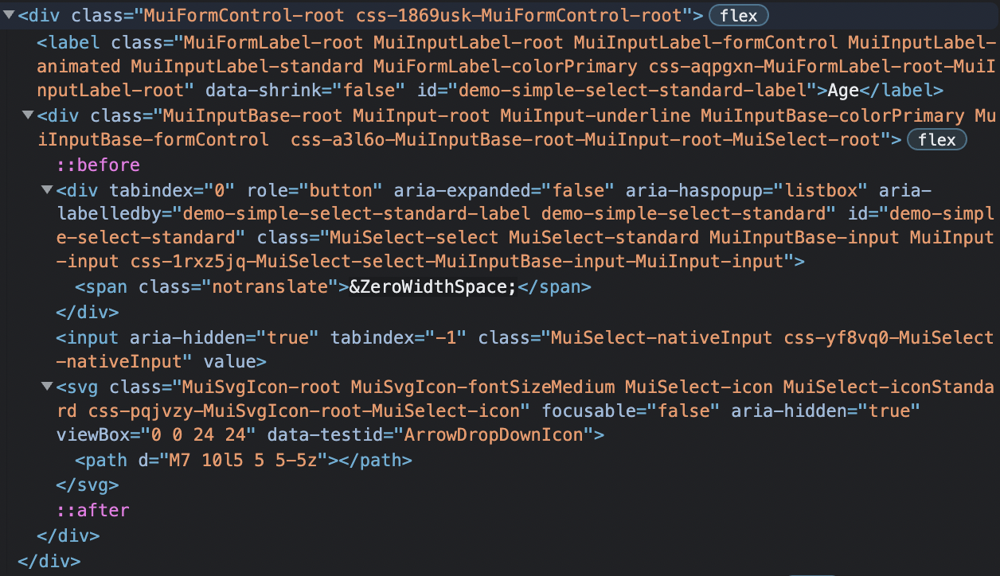

## 📌 **Mui Select 컴포넌트는 Semantic하지 않다**

mui Select 컴포넌트를 사용하려고 하는데, mui Select 컴포넌트의 demo 코드에 있는 id, label, labelId가 문서를 봐서는 무엇을 의미하는지 잘 이해가 안됐다. 개발자 도구를 통해서 보려고 했는데, Select 컴포넌트가 전혀 Semantic 하게 만들어지지 않았다는 것을 알게되었다. select 태그는 사용되지도 않았을 뿐더러, 같이 사용되는 label 역시도 웹 접근성을 위해 사용되는 for 속성이 없었다.



일전에 웹 접근성을 준수하면서 select 태그를 커스터마이징하는데 고통의 시간을 보낸 경험이 있는데, Mui는 웹 접근성 부분을 포기한 것 같다.

---

## 📌 TwoOptionsModal 공용 컴포넌트 만들기

아래와 같이 두개의 선택지가 있는 모달이 여기저기서 사용된다고 해보자


처음에 본인은 아래와 같이, TwoOptionsModal이라는, Mui 컴포넌트를 감싸는 공용 컴포넌트를 만들었다.

```javascript
import { Modal } from '@mui/material'

interface TwoOptionsModalProps {
  isModalOpen: boolean;
  leftBtnName: string;
  rightBtnName: string;
  children: ReactNode;
  onCloseModal: () => void;
  onClickLeftBtn?: () => void;
  onClickRightBtn?: () => void;
}

const TwoOptionsModal = ({
  isModalOpen,
  leftBtnName,
  rightBtnName,
  onCloseModal,
  onClickLeftBtn,
  onClickRightBtn,
  children,
}: TwoOptionsModalProps) => {
  return (
    <Modal open={isModalOpen} onClose={onCloseModal}>
      <ModalContentWrapper ref={modalWrapperRef}>
        <ChildrenWrapper>{children}</ChildrenWrapper>
        <BtnWrapper>
          <ModalBtn onClick={onClickLeftBtn}>{leftBtnName}</ModalBtn>
          <ModalBtn onClick={onClickRightBtn}>{rightBtnName}</ModalBtn>
        </BtnWrapper>
      </ModalContentWrapper>
    </Modal>
  )
}
```

문제는, 다른 페이지에서 TwoOptionsModal를 만들 때, 이를 컴포넌트화 해야하는 경우 아래와 같이 매번 interface를 만들고, TwoOptionsModal에 prop을 전달해주어야 하는 단점이 있었다.

```javascript
import TwoOptionsModal from '@components/TwoOptionsMdoal'

interface DeleteConfirmModalProps {
  isModalOpen: boolean;
  leftBtnName: string;
  rightBtnName: string;
  onCloseModal: () => void;
  onClickLeftBtn: () => void;
  onClickRightBtn: () => void;
}

const DeleteConfirmModal = ({
  isModalOpen,
  leftBtnName,
  rightBtnName,
  onCloseModal,
  onClickLeftBtn,
  onClickRightBtn,
}: DeleteConfirmModalProps) => {
  return (
    <TwoOptionsModal
      isModalOpen={isModalOpen}
      leftBtnName={leftBtnName}
      rightBtnName={rightBtnName}
      onCloseModal={onCloseModal}
      onClickLeftBtn={onClickLeftBtn}
      onClickRightBtn={onClickRightBtn}
    >
        { ... }
    </TwoOptionsModal>
  )
}
```

금주에 HOC 아티클을 읽고 아이디를 얻어, 아래와 같은 방향으로 컴포넌트를 수정했다.

```javascript
const withTwoOptionsModal = Component => {
  return ({
    isModalOpen,
    leftBtnName,
    rightBtnName,
    onCloseModal,
    onClickLeftBtn,
    onClickRightBtn,
  }: TwoOptionsModalProps) => (
    <TwoOptionsModal
      isModalOpen={isModalOpen}
      leftBtnName={leftBtnName}
      rightBtnName={rightBtnName}
      onCloseModal={onCloseModal}
      onClickLeftBtn={onClickLeftBtn}
      onClickRightBtn={onClickRightBtn}
    >
      <Component />
    </TwoOptionsModal>
  )
}
```

```javascript
import withTwoOptionsModal from '@components/TwoOptionsMdoal'

const DeleteConfirmModal = () => {
  return { ... } // 컴포넌트 구현 내용
}

export default withTwoOptionsModal(DeleteConfirmModal);
```

---

## 📌 git의 case insensitive

금일 컴포넌트를 만들면서, 파일 이름을 실수로 파스칼 케이스가 아닌 카멜 케이스로 PR을 올렸다. 다시 파스칼 케이스로 바꿔 push하려고 했는데, git이 파일 이름 변화를 추적하지 못하는 문제에 부딪혔다. **[리서치](https://stackoverflow.com/questions/17683458/how-do-i-commit-case-sensitive-only-filename-changes-in-git/17688308#17688308)** 해보니 git은 기본적으로 case insensitive하기 때문에, 소문자 대문자 변경은 추적하지 못한다고 한다. 지금까지 파일 이름 변경해도 이런적이 없었는데 왜 갑자기?라는 생각이 들던차에 오롯이 대소문자 변경은 이번이 처음인 것을 깨달았다.

어찌됐건 stackoverflow에서 제시하는 방법은 다음 세가지가 존재했다.

1. git rm oldName \_oldName && git rm \_oldName newName
2. git config core.ignorecase false
3. git rm -r --cached . && git add .

**[1번의 경우](https://stackoverflow.com/questions/17683458/how-do-i-commit-case-sensitive-only-filename-changes-in-git/20907647#20907647)**, 경로를 전부 입력해야하고, 중간 이름(\_oldName)을 거쳐야 한다는 번거로움이 있다.

**[2번의 경우](https://stackoverflow.com/questions/17683458/how-do-i-commit-case-sensitive-only-filename-changes-in-git/17688308#17688308)**, git이 case sensitive하도록 설정하는 것이다. 하만 OS가 case insensitive할때, git을 case sensitive하게 만드는 것은 **[side effect](https://stackoverflow.com/questions/17683458/how-do-i-commit-case-sensitive-only-filename-changes-in-git#comment45149115_17688308)** 가 발생할 수 있다고 한다. 가령 MAC에서 a라는 파일 이름을 A로 바꾸어서 push하면, repo에는 a라는 파일과 A라는 파일이 동시에 존재한다는 것이다. **[이외에도](https://dlee0129.tistory.com/25)** 여러가지 현상이 존재하는 것 같아서 이 방법도 패스했다.

**[3번의 경우](https://stackoverflow.com/questions/17683458/how-do-i-commit-case-sensitive-only-filename-changes-in-git/55541435#55541435)**, 경로를 입력하거나, 중간 이름을 거쳐야 한다는 번거로움도 없고, side effect에 대한 언급도 없기 때문에 이 방법을 선택하게 되었다.

---

## 📌 git rm -r --cached file 이란?

**[stackoverflow](https://stackoverflow.com/questions/54575972/difference-between-git-rm-git-rm-cached)** 의 답변을 가져왔다. rm은 remove를 의미한다. git rm은 대상 파일을 index에서도 지우고, working tree에서도 지우지만, git rm --cached는 index에서만 지우고, working tree에는 파일을 남겨둔다. 그리고 r은 recursive를 의미한다. 그러므로 3번 방법이 의도하는 바는 git rm -r --cached가 의도하는 바는, 현재 프로젝트에서 존재하는 file들 unstaged 상태로 만들고, git add .를 통해서 다시 staged 상태로 만들어서 대소문자가 바뀐 파일을 git이 추적하게 만드는 것이다. 참고로 index나 working tree에 대한 설명은 **[여기](https://backlog.com/git-tutorial/git-workflow/)** 에 잘 나와있다.

---

## 📌 금주 읽은 문서

**[HOC 패턴에 관해서](https://www.patterns.dev/posts/hoc-pattern/)**

