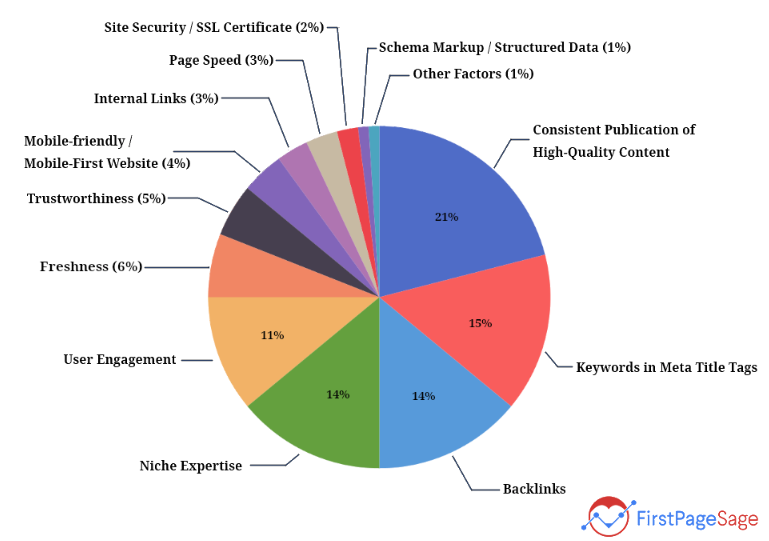
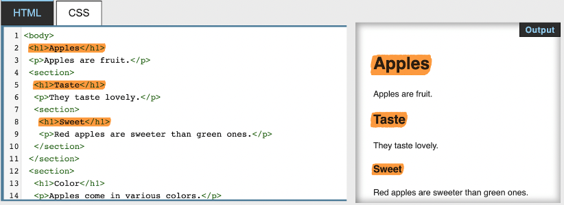
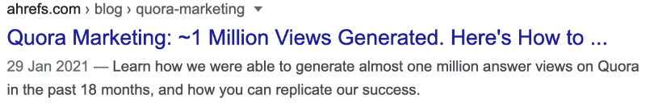

SEO에 있어서 h1 태그는 어떤 의미를 가질까?

## 1. 검색 엔진이 페이지 콘텐츠를 이해하는 데 도움을 준다

구글의 John Mueller가 [언급하길](https://www.youtube.com/watch?v=rwpwq8Ynf7s&t=1427s), 어떤 페이지의 rank가 향상되길 원한다면 이해하기 쉽도록 작성하는 것이 좋다고 한다. 그리고 검색 엔진은 독자와 같아서 h1 태그를 통해 방문한 페이지가 어떤 페이지인지 이해한다.

이 말인즉슨, h1 태그가 자세할수록 더 좋다는 의미이다.

## 2. UX를 향상시킨다

h1 태그를 통해서 어떤 페이지인지 한눈에 알 수 있다는 점에서 h1 태그는 UX에 도움이 된다. 그리고 UX는 [SEO ranking factor](https://developers.google.com/search/docs/appearance/page-experience)다.

[이미지 출처](https://firstpagesage.com/seo-blog/the-google-algorithm-ranking-factors/1)

## 3. 웹 접근성을 향상시킨다

웹 접근성 솔루션을 제공하는 비영리단체인 [WebAIM](https://webaim.org/projects/screenreadersurvey7/#finding)에서는 스크린 리더를 사용하는 독자들의 60%는 heading 태그를 이용해 페이지 네비게이션을 한다는 설문 결과를 발표했다.

웹 접근성은 정량화가 어렵기 때문에 직접적인 ranking factor가 될 수 없지만, 웹 접근성이 좋은 웹사이트는 좋은 UX를 갖게 되고, UX는 웹 접근성보다 측정이 훨씬 쉽다.

그리고 W3C에서 제안하는 웹 접근성 가이드라인인 [Web Content Accessibility Guidelines(WCAG)](https://www.w3.org/TR/WCAG21/)이 제시하는 기준은 SEO 규칙과 요구사항을 서술하는 [Google Search Essentials](https://developers.google.com/search/docs/essentials)과 거의 동일하다.

그렇다면 h1 태그는 어떻게 잘 작성할 수 있을까?

## 1. h1 태그는 페이지 타이틀로 작성한다

[구글](https://support.google.com/news/publisher-center/answer/9607104?hl=en-GB)에서는 h1 태그와 같이 아티클의 내용 위의 눈에 띄는 위치에 아티클의 제목을 사용하라고 제시하고 있다.

## 2. Title Case를 사용한다

[Title Case](https://dictionary.cambridge.org/ko/%EC%82%AC%EC%A0%84/%EC%98%81%EC%96%B4/title-case)란 책 혹은 영화의 제목에 포함되는 단어 중 중요한 단어를 대문자로 작성하는 것이다. 대문자로 작성하는데는 여러가지 복잡한 규칙이 존재하는데 [작성 사이트](https://capitalizemytitle.com/)의 도움을 받을 수 있다.

## 3. h1 태그와 Title 태그를 일치시킨다

[구글](https://support.google.com/news/publisher-center/answer/9607104?hl=en-GB)에서는 h1 태그와 title 태그를 일치시키라고 제시하고 있다. 하지만 h1 태그가 너무 길어질 경우에는 title 태그를 대략적으로 일치시켜도 좋다.

검색 엔진에는 title 태그 내용이 노출된다. 만약 title 태그와 h1 태그가 전혀 다르다면 title 태그 내용을 기대하고 들어온 독자들은 전혀 다른 내용의 h1 태그를 보고 속았다고 생각하게 될 것이다.

## 4. 중요하다고 생각되는 모든 페이지에 h1 태그를 작성한다

다만, 중요하다고 생각되지 않거나 검색 엔진에 보여질 필요가 없는 페이지라면 굳이 h1 태그를 넣을 필요는 없다.

## 5. 페이지당 하나의 h1 태그만 작성한다

구글 검색 엔진은 둘 이상의 h1 태그가 존재하는 상황을 고려하여 동작하기 때문에 SEO 관점에서는 이 규칙을 신경 쓰지 않아도 된다.

더불어서 HTML5에서 둘 이상의 h1 태그를 사용하면 아래 사진과 같이 위계에 맞게 heading 태그를 렌더링한다.

반면에 W3C에서는 레거시 브라우저의 경우 이러한 렌더링에 어려움이 있을 수 있기 때문에 위계에 맞는 heading 태그 사용을 추천하고 있다.

종합해보면 둘 이상의 h1 태그 사용이 SEO에 문제가 없더라도 레거시 브라우저의 렌더링 결과를 고려하여 위계에 맞게 heading 태그를 사용하는 것이 좋다.

## 6. 짧게 작성한다

대략 70자 이하로 작성하는 것이 좋다. 앞서 h1 태그와 title 태그를 일치시켜야 한다고 언급했다. 만약 h1 태그를 너무 길게 작성한다면 title 태그가 다음 이미지와 같이 검색 결과에서 잘릴 수 있다.

h1 태그를 길게 작성하고 title 태그를 짧게 작성하는 것을 고민하는 것보다 애초에 h1 태그를 짧게 작성하는 것이 좋다.

## 7. heading 태그 간 위계에 맞게 스타일을 적용한다

h1 태그는 페이지에서 가장 중요한 heading이다. 그러므로 페이지에서 가장 두드러져야 한다. 너무나도 당연해 보이지만, 여러 웹 사이트들이 h1과 h2 태그 구분을 해놓지 않았다.

## 8. 중요한 키워드를 포함한다

h1 태그는 페이지의 주제를 가리킨다. 그러므로 중요한 키워드를 포함하는 것이 좋다. 하지만 리스트를 나열해야 하는 상황, 예를 들면 유튜브에서 더 많은 시청 기록을 끌기 위한 방법들을 소개하는 페이지의 제목이라면 "14 Proven Ways to Get More Views on Youtube"와 같이 융통성있게 변형해도 좋다.

## 참고 문헌

[What is an H1 Tag? SEO Best Practices](https://ahrefs.com/blog/h1-tag/)

[What Is an H1 Tag? Why It Matters & Best Practices for SEO](https://www.semrush.com/blog/h1-tag/)

[How Much Does Google Care About Accessibility?](https://www.boia.org/blog/how-much-does-google-care-about-accessibility)
