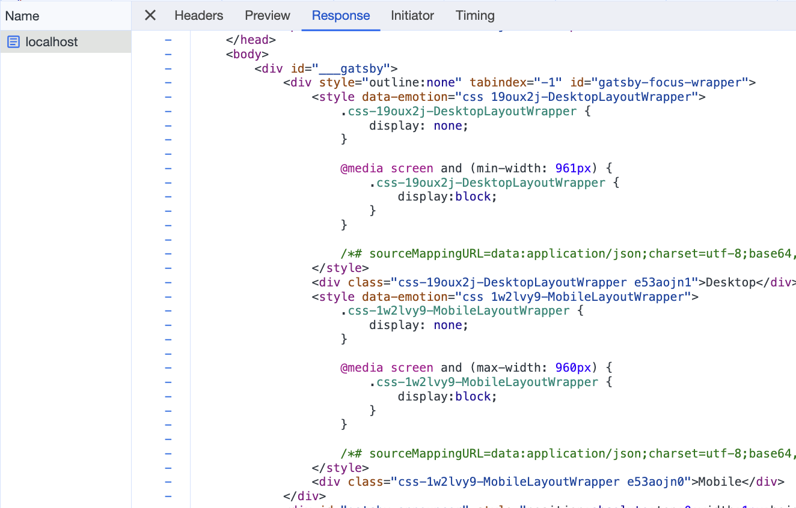
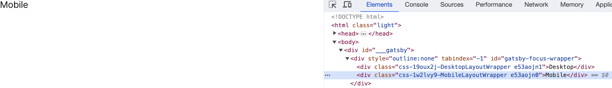
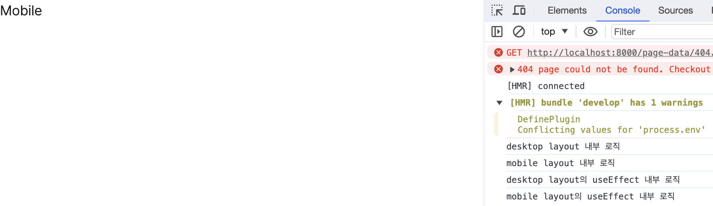
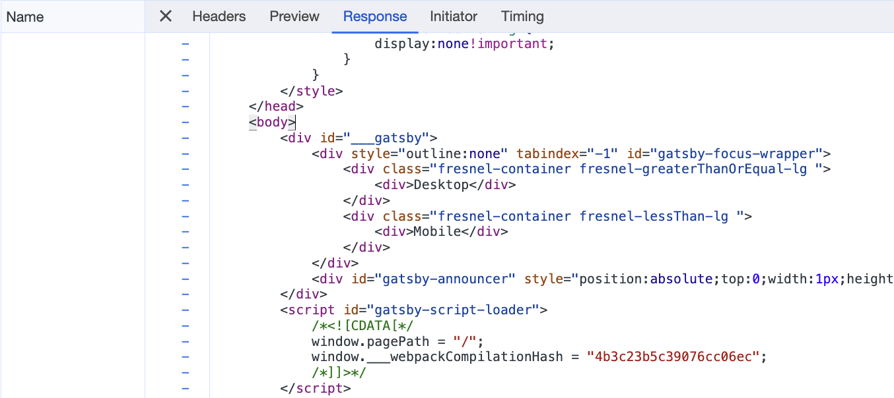
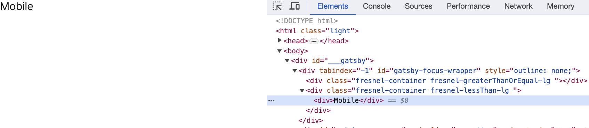
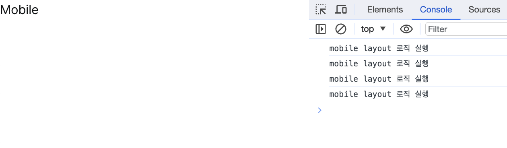

nextjs에서 pre-render는 pre-render를 하는 시점에 따라 두가지 형태로 나뉜다. 첫번째는 static generation으로 빌드할 때 pre-render를 하는 것이다. 두번째는 server-side rendering으로 요청이 들어왔을 때 pre-render를 하는 것이다. 어떤 형태든 클라이언트에서 HTML을 만들지 않는다.

하지만 반응형 웹 구현은 클라이언트에 의존적이다. 그렇다면 pre-render 상황에서 어떻게 반응형 웹을 구현할 수 있을까? 여러가지 방법들에 대해 알아보자.

## 1. user-agent 이용하기

요청 헤더 중 user-agent는 다음과 같이 클라이언트의 OS, 엔진, 브라우저 정보를 포함하고 있다.

```
Mozilla/5.0 (Macintosh; Intel Mac OS X 10_15_2) AppleWebKit/537.36 (KHTML, like Gecko) Chrome/79.0.3945.130 Safari/537.36
```

그리고 대부분의 모바일 기기는 user-agent에 Mobile이라는 키워드를 담아서 보내는데, 이를 이용하여 반응형 웹을 구현할 수 있다. 다음은 UAParser 라이브러리로 user-agent를 파싱하여 반응형 웹을 구현한 것이다.

```javascript
// Server
const uaParser = require('ua-parser-js');

const userAgent = uaParser(req.headers['user-agent']);
const { type } = userAgent.getDevice();

const html = ReactDOMServer.renderToString(
  <DeviceContext.Provider type={{ type }}>
    <App />
  </DeviceContext.Provider>,
);

// Client
const App = () => (
  <DeviceContext.Consumer>
    {({ type }) => (type === 'mobile' ? <MobileLayout /> : <DesktopLayout />)}
  </DeviceContext.Consumer>
);
```

하지만 이 방법은 user-agent로부터 구체적인 디바이스 뷰포트나 가로 모드 여부를 알 수 없다는 치명적인 단점이 있다. 그러므로 만약 데스크톱에서 브라우저를 모바일 사이즈로 줄여서 페이지를 요청하는 경우 반응형 대응이 불가하다. 더불어서 브라우저마다 Mobile 키워드가 아닌 Mobi, IEMobile, Tablet 등의 다른 키워드를 사용하는 문제점도 존재한다.

## 2. 하나의 진입점에 media-query 적용

아래 App 컴포넌트는 하나의 div라는 진입점에 media-query를 적용하여 반응형 웹을 구현했다. 이 방법은 기기의 뷰포트에 상관없이 모두 동일한 DOM 트리 구조를 갖는 특징이 있는데, 만약 뷰포트에 따라 다른 DOM 트리 구조를 보여줘야 한다면 다른 방법을 선택해야 한다.

```javascript
.layout {
  width: 80vh;
}

@media screen and (max-width: 768px) {
  .layout {
    width: 100vh;
  }
}

const App = () => (<div className="layout">My Application</div>);
```

## 3. 여러 진입점에 media-query 적용

뷰포트에 따라 다른 DOM 트리 구조를 보여줘야 하는 경우 다음과 같이 여러 진입점에 media-query를 적용해준다.

```javascript
import styled from '@emotion/styled';

export default function PostDetail() {
  return (
    <>
      <DesktopLayout />
      <MobileLayout />
    </>
  );
}

const DesktopLayout = () => {
  return <DesktopLayoutWrapper>Desktop</DesktopLayoutWrapper>;
};

const MobileLayout = () => {
  return <MobileLayoutWrapper>Mobile</MobileLayoutWrapper>;
};

const DesktopLayoutWrapper = styled('div')(() => ({
  display: 'none',

  '@media screen and (min-width: 961px)': {
    display: 'block',
  },
}));

const MobileLayoutWrapper = styled('div')(() => ({
  display: 'none',

  '@media screen and (max-width: 960px)': {
    display: 'block',
  },
}));
```

언뜻 보기에는 이전 방법과 큰 차이가 없어보이지만 한 가지 알고 넘어가야 하는 부분이 존재한다.

pre-render된 페이지의 html 응답을 보면 아래와 같이 MobileLayout과 DesktopLayout 태그가 모두 DOM 트리에 존재한다.



이는 클라이언트 DOM 트리도 마찬가지이다.



하지만 화면을 보면 실제 MobileLayout이나 DesktopLayout 둘 중 하나만 보여지고 있다. 즉, Render 트리에는 하나만 포함된다.

문제는 보여질 필요가 없는 태그까지 DOM 트리에 포함되기 때문에 페이지 사이즈가 커지고, 더욱 더 심각한 것은 보여질 필요가 없는 태그까지 모두 마운트 된다는 것이다. 이는 사이드 이펙트로 연결될 수도 있다.

조금 더 자세히 설명하면, display: none을 하는 경우 태그는 DOM 트리에 포함되고 Render 트리에는 포함되지 않는다. DOM 트리에 포함된다는 것은 태그가 마운트 됐다는 것이고, 마운트된 태그는 useEffect를 포함한 내부의 모든 로직들을 실제로 실행한다. 이는 사이드 이펙트로 연결될 수 있다.

실제로 DesktopLayout과 MobileLayout에 콘솔을 작성하고 MobileLayout이 보여질 크기로 화면을 축소하여 페이지를 요청하면 DesktopLayout 내부의 콘솔도 찍히는 것을 확인할 수 있다.

```javascript
const DesktopLayout = () => {
  console.log('desktop layout 내부 로직');

  useEffect(() => {
    console.log('desktop layout의 useEffect 내부 로직');
  }, []);

  return <DesktopLayoutWrapper>Desktop</DesktopLayoutWrapper>;
};

const MobileLayout = () => {
  console.log('mobile layout 내부 로직');

  useEffect(() => {
    console.log('mobile layout의 useEffect 내부 로직');
  }, []);

  return <MobileLayoutWrapper>Mobile</MobileLayoutWrapper>;
};
```



굳이 로직 실행에 의한 사이드 이펙트 상황이 아니더라도 문제는 발생할 수 있다. 예를들면 3개의 h1 태그가 존재하고 2개의 h1 태그를 display: none 처리하는 경우, 크롤러는 display: none 처리된 h1 태그를 인식하기 때문에 이 경우 페이지당 하나의 h1 태그가 존재해야하는 규칙을 어기게 되는 것이다.

## 6. @artsy/fresenel 이용하기

이 라이브러리는 앞선 방법과 마찬가지로 pre-render시 반응형 웹에 필요한 태그가 모두 포함된 DOM 트리를 그린다. 하지만 앞선 방법과는 다르게 보여질 필요가 없는 태그는 클라이언트 DOM 트리에 포함되지 않아 마운트로 인한 사이드 이펙트 문제가 발생하지 않는다.

코드는 다음과 같이 작성한다.

```javascript
import { Media, MediaContextProvider } from '@/components/Media';

const Main = () => {
  return (
    <MediaContextProvider>
      <Media greaterThanOrEqual="lg">
        <Desktop />
      </Media>
      <Media lessThan="lg">
        <Mobile />
      </Media>
    </MediaContextProvider>
  );
};

export default Main;

const Desktop = () => {
  return <div>Desktop</div>;
};

const Mobile = () => {
  return <div>Mobile</div>;
};
```

앞선 방법과 마찬가지로 pre-render된 페이지의 html 응답을 보면 아래와 같이 MobileLayout과 DesktopLayout 태그가 모두 DOM 트리에 존재한다.



하지만 앞선 방법과는 다르게 실제 화면의 DOM 트리를 보면 뷰포트에 대응하는 태그만 포함된 것을 알 수 있다.



물론 마운트가 되지 않으니 내부에서 콘솔도 전혀 찍히지 않는다.

```javascript
const Desktop = () => {
  console.log('desktop layout 로직 실행');

  useEffect(() => {
    console.log('desktop layout useEffect 내 로직 실행');
  }, []);

  return <div>Desktop</div>;
};

const Mobile = () => {
  console.log('mobile layout 로직 실행');

  useEffect(() => {
    console.log('mobile layout useEffect 내 로직 실행');
  }, []);

  return <div>Mobile</div>;
};
```



참고로 style을 head에 injection하는 이유는 [flicker](https://twitter.com/victorczhou/status/1320060284250157056?ref_src=twsrc%5Etfw%7Ctwcamp%5Etweetembed%7Ctwterm%5E1320060284250157056%7Ctwgr%5Ef0bd1013763998e846ea85b391547dbc05d02b2b%7Ctwcon%5Es1_&ref_url=https%3A%2F%2Fvictorzhou.com%2Fblog%2Fdark-mode-gatsby%2F)를 없애기 위함인데, html이 파싱될 때 style 태그가 먼저 파싱되게 함으로써 이를 해결한다.

그렇다면 @artsy/fresnel은 반응형 웹 구현에 있어서 은탄환일까? 아니다. @artsy/fresnel은 다음과 같은 문제점들이 존재한다.

1. 여전히 페이지 사이즈가 커지는 문제를 해결하지 못했다.

2. breakpoint로의 접근은 Media를 통해서만 가능하고, 다음과 같이 다른 컴포넌트들은 직접 접근이 불가하다.

```javascript
<Sans size={sm ? 2 : 3}>
```

3. react 18 버전 문제로 인해서 개발 환경에서 Hydration 에러가 발생한다. [이슈](https://github.com/artsy/fresnel/issues/297)

참고로 반응형 웹을 구현하기 위한 라이브러리로는 @artsy/fresnel 이외에도 [react-responsive](https://github.com/yocontra/react-responsive)와 [react-media](https://github.com/ReactTraining/react-media)가 존재한다. 하지만 이 둘은 pre-render 상황에서 반응형 웹 구현을 깊이있게 고려하지 않았다.

먼저 react-media는 pre-render 환경에서의 반응형 웹을 user-agent 방법으로 해결하고 있다. 그리고 react-responsive는 기본적으로 pre-render하지 않는다. 서버에서 어떤 뷰포트로 그릴 것인지 [device 프로퍼티](https://github.com/yocontra/react-responsive#forcing-a-device-with-the-device-prop)로 미리 정해줄 수 있지만, 정하지 않는다면 기본적으로는 pre-render되지 않는다.

## 참고 문헌

[Server-Rendering Responsively](https://artsy.github.io/blog/2019/05/24/server-rendering-responsively/)

[React 02 - SSR vs Responsive Design](https://medium.com/@houwei.shen/react-02-ssr-vs-responsive-design-f6a90e58c669)

[Two duplicated h1 tags and one hidden](https://webmasters.stackexchange.com/questions/81655/two-duplicated-h1-tags-and-one-hidden)
