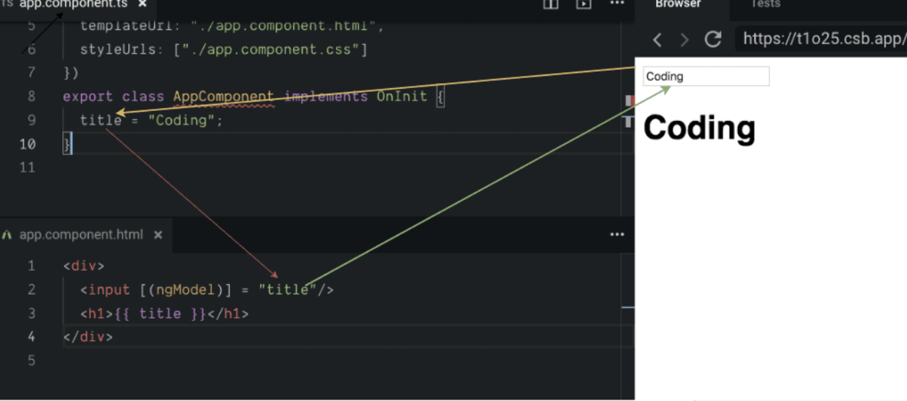

본 글은 [React State Management Libraries and How to Choose](https://daveceddia.com/react-state-management/)의 일부를 번역해놓은 글 입니다.

## 📌 State

웹에서 버튼을 클릭하면 사이드바가 사라지거나, 메세지를 보내면 채팅창에 나타나는 등 웹은 이벤트에 반응합니다.

이벤트가 발생할 때, 웹은 이벤트에 반응하기 위해서 업데이트가 일어나는데, 이러한 업데이트를 우리는 **웹의 상태가 변한다**라고 표현합니다. 그리고 사이드바가 사라지는 것 처럼 화면의 모습이 바뀌게 되죠.

웹 개발자들은 ‘사이드바가 보여질지 안보여질지의 결정’, ‘채팅창 내의 메세지’들 등을 전부 상태로 보게됩니다. 그리고 이 상태들의 실체는 결국 데이터입니다. 웹 어딘가에 isSidebarOpen 데이터가 true 혹은 false로 되어있고, chatMessages 배열 데이터가 존재하는 것입니다.

앞서 말한 웹 어딘가는 단순히 컴포넌트 내부의 상태가 될 수 있고 혹은 이번 주제에서 다룰 상태 관리 라이브러리의 store에 존재할수도 있습니다.

---

## 📌 State Management

앞서 말했듯이 상태는 웹 어딘가에 저장되어 있습니다. 그리고 State Management는 이 상태를 어떻게 저장하고, 어떻게 변화시킬 것인가를 의미합니다.

저장 장소에 관해서는 useState, useReducer를 호출한 컴포넌트 내부가 되거나, Redux, Mobx, Recoil, Zustand 각각의 store가 될수 있습니다. (본문에서는 window에 저장하는 방법도 이야기하고 있지만, 일반적인 상황도 아닌 것 같고, 마주하지도 못해서 window 관련 내용은 생략하겠습니다)

---

## 📌 데이터를 변화시키고 화면을 다시 그리는 것

앞에서 이벤트가 발생하면 상태가 변하고, 상태가 바뀌었기 때문에 화면이 바뀐다고 말했습니다. 하지만 이벤트가 발생한다고 해서 상태가 변하는 것은 아니며, 상태가 변한다고해서 화면이 바뀌는 것은 아닙니다. **(1) 이벤트와 상태 변화를 연결**시켜야 하고, **(2) 상태 변화를 리액트에게 알려야 합니다**. 이후 리액트는 **(3) 리렌더링**을 발생하여 변화한 상태에 맞게 화면을 다시 그려줍니다.

인식하지 못했겠지만 개발자 여러분들은 이 행위를 자연스럽게 해왔습니다. 이벤트 핸들러 내부에서 state setter를 호출하는 것이 (1)에 해당되고, state setter를 호출함으로서 (2), (3)이 자연스럽게 이루어집니다. (2)를 보면 알겠지만 리액트는 이름과는 다르게 다른 프레임워크(Angular, Svelete, Vue)처럼 ‘reactive’하지 않습니다. 이는 리액트가 ‘단방향 데이터 바인딩(one way data binding)’이기 때문입니다.

위 내용을 이해했다면, 아래 버튼을 누를 때마다 count는 분명 증가하는 것을 console을 통해서 확인할 수 있지만, 화면에는 계속 0이 표시되는 이유를 이해할 것입니다.

```javascript
function App() {
  let count = 0

  return (
    <>
      <button
        onClick={() => {
          count += 1
          console.log(count)
        }}
      >
        CountUp
      </button>
      <div>{count}</div>
    </>
  )
}
```

state setter의 경우, useState, useReducer, this.setState 이거나 redux, mobx, recoil이 각각의 방식으로 상태 변화를 react에게 알릴 것 입니다.

---

## 📌 Data Binding

데이터를 View와 연결하는 것을 의미하며, 데이터의 흐름 방향에 따라서 (1) 단방향 데이터 바인딩(One-way data binding)과 (2) 양방향 데이터 바인딩(Two-way data binding) 두가지로 나뉩니다.

이름에서 느껴지듯, 데이터가 한쪽 방향으로밖에 못 흐른다면 단방향 데이터 바인딩 이라고 하고, 이 경우 데이터가 변해야만 UI가 변합니다.


데이터가 양쪽 방향으로 모두 흐를 수 있다면 양방향 데이터 바인딩이라고 하고, 단방향 데이터 바인딩과는 다르게 UI가 변해도 내부 데이터가 변할 수 있습니다.



---

## 📌 useState

useState는 단일 값을 저장할 수 있습니다. 만약 단일 값으로 여러 데이터를 갖고 있는 객체를 저장하려고 한다면, 가급적 쪼개는 것이 좋습니다.

useState는 3개 혹은 5개를 초과하는 경우, 앱의 변경사항을 예측하거나 추적하기 어렵게 만들 수 있다는 문제점이 있습니다. 특히 이 상태들이 서로에게 의존한다면 더더욱 그렇습니다. 만약 의존성이 복잡하다면, [state machine](<[https://daveceddia.com/react-confirmation-modal-state-machine/](https://daveceddia.com/react-confirmation-modal-state-machine/)>)을 고려해보는 것도 좋습니다.

---

## 📌 useReducer

useReducer의 경우, 한 곳에서 action에 따라서 상태를 업데이트 시킬 수 있는 기능을 제공합니다. useState와 마찬가지로 오직 하나의 값을 저장할 수 있지만, 보통 여러 값을 갖는 객체를 저장하여, 해당 객체를 좀 더 관리하기 쉽게 만들어줍니다.

useReducer 용례와 관련한 구체적인 내용은 [여기](<[https://jsramblings.com/should-you-switch-to-usereducer-or-is-usestate-enough-for-your-needs/](https://jsramblings.com/should-you-switch-to-usereducer-or-is-usestate-enough-for-your-needs/)>)를 참고하는 것을 추천드립니다.

---

## 📌 ContextAPI

다음으로 만나게되는 문제는 prop driling 입니다. 리액트 컴포넌트 트리에서, 하나의 컴포넌트가 상태를 가지고 있고, 해당 컴포넌트보다 5 레벨 밑에 있는 컴포넌트가 해당 상태에 접근하려고 할때를 생각해봅니다. 이때 상태를 prop으로서 수동적으로 drill down 해주어야 합니다. 여기서 prop은 property의 줄임말로, 부모 컴포넌트에서 자식 컴포넌트에게 넘겨주는 데이터입니다.

이 문제를 해결하기 위한 가장 쉬운 방법은 React에서 제공하는 ContextAPI를 이용하는 것입니다. 사용법은 아래와 같습니다.

```javascript
// 1. Context를 생성하여 export 합니다.
export const MyDataContext = React.createContext()
```

```javascript
// 2. 컴포넌트 내에서 drill down할 data를 다음과 같이 넘겨줄 수 있습니다.
const TheComponentsWithState = () => {
  const [state, setState] = useState('whatever')

  return (
    <MyDataContext.Provider value={state}>
      <ComponentThatNeedsData />
    </MyDataContext.Provider>
  )
}
```

```javascript
// 3. TheComponentsWithState 내부의 subcomponent들은, 다음과 같이 데이터를 꺼내어 사용할 수 있습니다.
const ComponentThatNeedsData = () => {
  const data = useContext(MyDataContext);
  { ... }
}
```

이러한 간결함에도 불구하고, ContextAPI는 사용 방법에 의존하는 한 가지 중요한 단점이 있습니다. useContext를 호출하는 모든 컴포넌트는 Provider의 value prop이 변할 때 리렌더링이 발생한다는 점입니다. 만약 value prop이 50개의 상태를 가지고 있는데, 이 상태 중 하나만 변경되더라도 useContext를 호출하는 모든 컴포넌트가 리렌더링 되어야 합니다.

이러한 단점을 피하기 위해서, 여러 개의 ContextAPI를 생성하고 연관된 데이터 끼리 묶어놓거나 혹은 라이브러리를 찾게 됩니다.

ContextAPI를 사용하면서 놓칠 수 있는 또 다른 문제점은, 아래 코드처럼 새로 생성되는 객체를 넘기는 것입니다. 놓치기 쉬운 문제죠.

```javascript
const TheComponentsWithState = () => {
  const [state, setState] = useState('whatever')

  return (
    <MyDataContext.Provider
      value={{
        state,
        setState,
      }}
    >
      <ComponentThatNeedsData />
    </MyDataContext.Provider>
  )
}
```

문제는 TheComponentsWith가 리렌더링 될때마다 state와 state setter를 감싸주는 객체가 새로 생성된다는 것 입니다.

여기까지 이야기를 하고 보면, ContextAPI는 사실 State Management보다는 단순히 상태를 전달하는 역할을 하고 있음을 알 수 있습니다. 맞습니다. 상태는 어딘가에 존재하고, ContextAPI는 단순히 이 상태를 전달해주는 역할에 불과합니다.

---

## 📚 참고 문헌

[Difference Between One-way and Two-way Databinding in Angular](https://reactgo.com/angular-oneway-vs-twoway-binding/)

