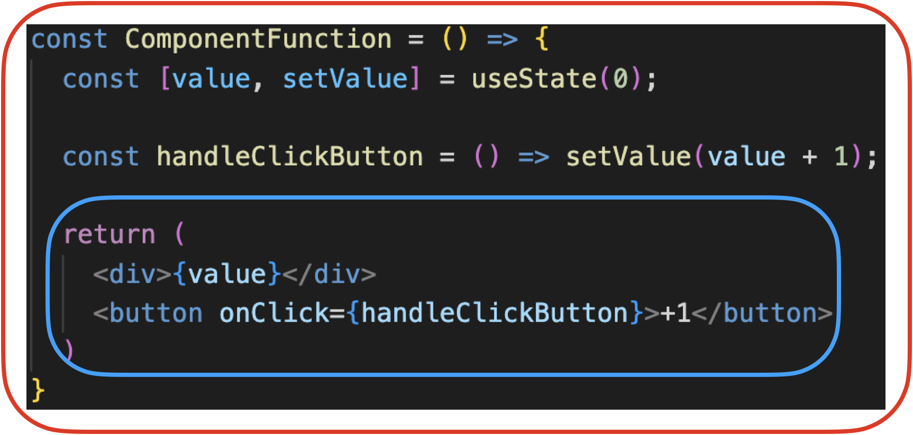
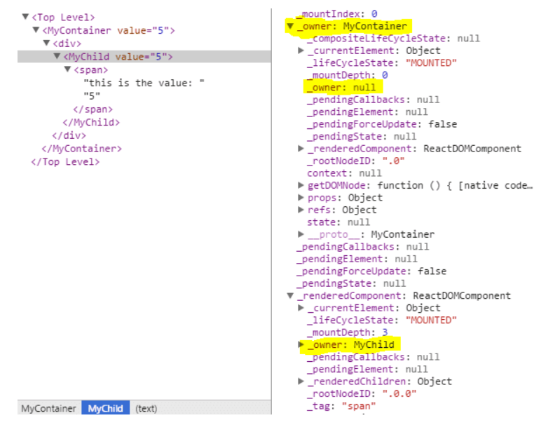

## 📌 객체 지향의 UI 프로그래밍 (object-oriented UI programming)

리액트 입문자라면 이전까지는 클래스 컴포넌트를 이용해서 작업해왔을 것입니다. 예를들면 클래스를 이용해서 각각의 프로퍼티와 상태를 갖고 있는 Button 인스턴스들을 만들어서 화면에 보여주는 것 입니다. 이것이 고전적인 객체 지향의 UI 프로그래밍이었습니다.

이러한 방식은 자식 컴포넌트 인스턴스 생성과 제거가 전적으로 개발자에게 달려있었습니다. Form 컴포넌트내에 Button 컴포넌트를 렌더링하기를 원한다면 Button 컴포넌트 인스턴스를 만들고 수동으로 Button 컴포넌트 인스턴스를 업데이트 해야했습니다. 예를들면 아래와 같이 말이죠.

```javascript
class Form extends TraditionalObjectOrientedView {
  render() {
    const { isSubmitted, buttonText } = this.attrs

    if (!isSubmitted && !this.button) {
      // 폼이 제출되지 않았다면 버튼을 만듭니다.
      this.button = new Button({
        children: buttonText,
        color: 'blue',
      })
      this.el.appendChild(this.button.el)
    }

    if (this.button) {
      // 버튼이 보여지면 텍스트를 업데이트합니다.
      this.button.attrs.children = buttonText
      this.button.render()
    }

    if (isSubmitted && this.button) {
      // 폼이 제출되면 버튼을 제거합니다.
      this.el.removeChild(this.button.el);
      this.button.destroy();
    }

    if(isSubmitted && !this.message) s{
        // 폼이 제출되면ㄴ 성공 메세지를 보여줍니다.
        this.message = new Message({ text: 'Success' })
        this.el.appendChild(this.message.el)s
    }
  }
}
```

각 컴포넌트 인스턴스(this.button)는 자신의 DOM 노드에 대한 참조와 자식 컴포넌트들의 인스턴스에 대한 참조를 유지하고, 적절한 흐름에 맞게 이들을 생성, 업데이트, 제거해야합니다. 컴포넌트의 상태에 따라서 코드 라인 수는 제곱으로 증가하고, 부모 컴포넌트가 자식 컴포넌트에 직접적으로 접근이 가능해지면서 컴포넌트간 결속력이 커지게됩니다.

그렇다면 리액트는 어떻게 이 문제를 해결하였을까요?

---

## 📌 React Element

리액트에서는 이 문제를 Element가 해결해줍니다. Element는 DOM Element와는 다른 일반 자바스크립트 객체(plain javascript object)로 Component Instance와 DOM Node를 묘사하는 객체입니다. 상태가 없고 불변하며, [다음 프로퍼티들](https://github.com/facebook/react/blob/1d1e49cfa453b58769e87c3c8d321024d58c948f/packages/react/src/ReactElement.js#L148-L161)을 갖고 있습니다.

```javascript
{
	$$typeof: Symbol.for('react'),
	key: key,
	ref: ref,
	_owner: owner,
	type: type,
	props: props,
}
```

key, ref, type, props는 눈에 익을 것입니다. $$typeof와 \_owner가 무엇인지는 아래에서 다루겠습니다.

React Element는 instance가 아닙니다. 그렇기 때문에 this.button.render와 같이 메서드 호출도 불가능하며, 단순히 화면에 어떻게 보여지길 원하는지 리액트에게 알리는 수단일 뿐입니다.

---

## 📌 React Element의 생성

React Element는 createElement를 통해서 생성되며, createElement로 전달되는 인자는 다음과 같습니다.

```javascript
createElement(type, { props }, ...children)
```

~~createElement를 호출하지않고 일반 자바스크립트 객체를 직접 작성하는 것도 가능합니다. 아래 reactElementA와 reactElementB는 동일합니다.~~

```javascript
const reactElementA = createElement('div', { id: 'div-id' }, 'div-text')
const reactElementB = {
  type: 'div',
  props: {
    id: 'div-id',
    children: 'div-text',
  },
}
```

[공식 문서](https://reactjs.org/blog/2015/12/18/react-components-elements-and-instances.html#dom-elements)에서도 그렇고 다른 가이드 문서에서도 본것 같아서 위와 같이 적어놨는데, [여기](https://frontarm.com/courses/react-fundamentals/basics/elements-are-objects/)서 React Element에는 $$typeof와 \_owner 필드도 존재하기 때문에, React Element 객체를 직접 작성하여 생성하는 것은 불가능하다고 한다. createElement를 사용하거나 이후에 이야기할 JSX를 사용해야만 생성이 가능한 것 같다.

많이 사용하는 JSX문 역시도, 바벨에 의해서 createElement를 호출하도록 트랜스파일링되어 React Element가 생성됩니다.

참고로 JSX는 바벨을 통해서 createElement를 호출하도록 트랜스파일링 됩니다. 다음 코드들 처럼 말이죠.

```javascript
// JSX 표현
class ComponentOne extends React.Component {
  render() {
    return <p>Hello!</p>
  }
}

// 위 JSX문은 바벨에 의해서 다음과 같이 트랜스파일링 된다.
class ComponentOne extends React.Component {
  render() {
    return createElement('p', {}, 'Hello!')
  }
}

// JSX 표현
function ComponentThree() {
  return (
    <div>
      <ComponentOne />
      <ComponentTwo />
    </div>
  )
}

// 위 JSX문은 바벨에 의해서 다음과 같이 트랜스파일링 된다.
function ComponentThree() {
	return (
		createElement(
                  'div',
                  { },
                  createElement(ComponentOne, { });
                  createElement(ComponentTwo, { });
		)
}
```

React Element가 앞서 일반적인 DOM node를 묘사했듯이, 다음과 같이 Component도 묘사할 수 있습니다.

```javascript
const reactElement = {
  type: Button,
  props: {
    color: 'blue',
    children: 'OK',
  },
}
```

그리고 하나의 React Element 트리 안에 DOM node를 묘사하는 React Element와 Component를 묘사하는 React Element가 섞여 존재할 수 있습니다.

```javascript
const DeleteAccount = () => ({
  type: 'div',
  props: {
    children: [{
      type: 'p',
      props: {
        children: 'Are you sure?'
      }
    }, {
      type: DangerButton,
      props: {
        children: 'Yep'
      }
    }, {
      type: Button,
      props: {
        color: 'blue',
        children: 'Cancel'
      }
   }]
});
```

위 React Element를 JSX로는 다음과 같이 표현이 가능합니다.

```javascript
const DeleteAccount = () => (
  <div>
    <p>Are you sure?</p>
    <DangerButton>Yep</DangerButton>
    <Button color="blue">Cancel</Button>
  </div>
)
```

리액트는 이러한 React Element 구조를 통해서(JSX문으로 작성됐지만 결국에는 React Element 객체로 표현될테니까요) is-a 관계와 has-a 관계를 모두 표현함으로써 컴포넌트간 결속력을 떨어뜨립니다.

- Button은 몇가지 프로퍼티를 갖고 있는 button 입니다
- DangerButton은 몇가지 프로퍼티를 갖고 있는 Button 입니다.
- DeleteAccount는 div 내에 p, DangerButton, Button이 존재합니다.

---

## 📌 React Element와 React Component



위 이미지에서 적색 박스를 React Component라고 부르고, 청색 박스가 React Element라고 부릅니다.(물론 지금은 JSX로 작성되어 있지만, 결국 바벨에 의해서 React Element로 트랜스파일링됩니다.) 앞서 React Element가 무엇인지 정의했으나, 공식문서에 나온 다음 정의를 빌어서 다시 정의해보면,

> "A ReactElement is a light, stateless, immutable, virtual representation of a DOM Element."

DOM Element의 표현인데, 가볍고, 상태가없고, 불변이고, 가상(plain javascript object)의 표현입니다. 반면에 React Component는 React Element에서 상태가 추가된 것입니다.

---

## 📌 React Node와 JSX.Element

React Node는 React Element를 포함하며, React가 렌더링할수 있는 무엇이든 포함됩니다. [DefinitelyTyped](https://github.com/DefinitelyTyped/DefinitelyTyped/blob/master/types/react/index.d.ts)에 정의된 다음 React Node 타입 정의를 보면 이해가 갈 것입니다.

```javascript
/**
 * @deprecated - This type is not relevant when using React. Inline the type instead to make the intent clear.
 */
type ReactText = string | number
/**
 * @deprecated - This type is not relevant when using React. Inline the type instead to make the intent clear.
 */
type ReactChild = ReactElement | string | number

/**
 * @deprecated Use either `ReactNode[]` if you need an array or `Iterable<ReactNode>` if its passed to a host component.
 */
interface ReactNodeArray extends ReadonlyArray<ReactNode> {}
type ReactFragment = Iterable<ReactNode>
type ReactNode =
  | ReactElement
  | string
  | number
  | ReactFragment
  | ReactPortal
  | boolean
  | null
  | undefined
```

참고로 React Node는 클래스 컴포넌트의 return 메서드 반환 타입이기도 합니다. 반면에 함수형 컴포넌트의 return 메서드 반환 타입은 React Element입니다. [히스토리](https://github.com/microsoft/TypeScript/issues/21699)가 있는데, 커멘트가 너무 길어서 패스했습니다.

그리고 React Element의 props와 type에 대한 제네릭 타입이 any이면 JSX.Element가 됩니다. 다양한 library가 JSX를 각자의 방식대로 구현하기 위해서 존재한다고 하네요.

```javascript
interface ReactElement<P = any, T extends string | JSXElementConstructor<any> = string | JSXElementConstructor<any>> {
  type: T;
  props: P;
  key: Key | null;
}
```

---

## 📌 컴포넌트는 기본적으로 Element Tree를 캡슐화합니다.

앞서 객체 지향 UI의 Form을 리액트로 구현하면 다음과 같습니다.

```javascript
const Form = ({ isSubmitted, buttonText }) => {
  if (isSubmitted) {
    return {
      type: Message,
      props: {
        text: 'Success!',
      },
    }
  }

  return {
    type: Button,
    props: {
      children: buttonText,
      color: 'blue',
    },
  }
}
```

위 Form 컴포넌트 함수를 보듯이, 컴포넌트는 기본적으로 React Element 트리를 리턴합니다. 개발자는 Form 컴포넌트를 사용할 때 내부 DOM이 어떤식으로 구성되어 있는지 알 필요가 없습니다.

그리고 리액트가 다음과 같이 type이 컴포넌트 함수인 React Element를 만나게 되면,

```javascript
{
  type: Button,
  props: {
    color: 'blue',
    children: 'OK',
  }
}
```

리액트는 컴포넌트에게 어떤 React Element를 렌더링할 것인지 물어봅니다. 그리고 Button 컴포넌트는 다음과 같은 React Element를 return 합니다.

```javascript
{
  type: 'button',
  props: {
    className: 'button button-blue',
    children: {
      type: 'b',
      props: {
        children: 'OK!',
      }
    }
  }
}
```

리액트는 이렇게 묻고 답하는 과정을 계속 반복하며 하나의 React Element 트리를 만들어냅니다.

---

## 📌 React Element에 존재하는 $$typeof 와 \_owner 이해하기

### $$typeof

$\$typeof를 이야기하려면 보안에 관한 이야기를 해야합니다. 서버의 보안에 빈틈이 존재해서 유저가 임의로 작성한 React Element를 JSON 객체 형태로 서버에 저장하게([최적화](https://github.com/facebook/react/pull/3583#issuecomment-90296667)를 위해서 React Element 객체를 직접 작성하기도 한다고 합니다.)되었다고 가정합시다. 그리고 만약 이 객체가 아래와 같은 클라이언트 코드에 도달하게 되면 문제가 발생하게 됩니다.

```javascript
let expectedTextButGotJSON = {
  type: 'div',
  props: {
    dangerouslySetInnerHTML: {
      __html: '/* put your exploit here */',
    },
  },
  // ...
}
let message = { text: expectedTextButGotJSON }

<p>{message.text}</p>
```

React 0.13 버전까지만 해도 이러한 XSS 공격에 취약했는데, React 0.14 버전부터는 $$typeof 태그를 통해서 이 문제를 해결했습니다. 기본적으로 React Element마다 $$typeof가 존재하는데, Symbol은 JSON 안에 넣을 수 없기 때문에 리액트는 element.$$typeof를 통해서 element의 유효성을 확인합니다.

만약 브라우저에서 Symbol을 지원하지 않는 경우에는 이러한 보호가 이루어질 수 없습니다. 어찌됐건 일관성을 위해서 $$typeof 필드는 여전히 존재하는데, 이때 값으로 0xeac7이 할당됩니다. 0xeac7인 이유는 모양이 React와 닮아서입니다.

참고로 리액트를 포함한 모던 라이브러리는 기본적으로 텍스트 컨텐츠에 대해서 이스케이프 처리를 지원하기 때문에, message.text 내에 <나 >처럼 위험한 문자가 있는 경우 이스케이프 처리가 된다고합니다.

### \_owner

다음과 같은 코드가 있습니다.

```javascript
const MyContainer = props => <MyChild value={props.value} />
```

이를 통해서 다음을 알수 있습니다.

- <MyContainer>는 <MyChild>의 owner입니다.
- <MyChild>는 <MyContainer>의 ownee입니다.

이렇듯, DOM 관계를 나타내듯 부모/자식 관계로 이야기하지 않습니다.

다음과 같이 div태그로 MyChild 컴포넌트를 래핑해봅시다.

```javascript
const MyContainer = props => (
  <div>
    <MyChild value={props.value} />
  </div>
)
```

MyContainer는 MyChild의 부모가 아니라 owner입니다. React Chrome Developer Tools를 이용해서 본다면, 다음과 같이 보여집니다.



- <MyContainer>는 어떠한 owner도 갖고 있지 않습니다.
- <MyChild>의 owner는 <div>가 아닌 <MyContainer> 입니다.
- <span>의 owner는 <MyChild> 입니다.

owner에 대해서 정리해보면, 다음과 같습니다.

- owner는 React Element입니다.
- ownee는 무엇이든 될수 있습니다.(React Element 혹은 순수한 HTML 태그)
- 특정 node의 owner는 조상중에서 node 자신을 render하거나 prop을 전달하는 요소입니다.

## 📚 참고 문헌

[리액트 공식문서](https://reactjs.org/blog/2015/12/18/react-components-elements-and-instances.html)

[Difference between React Component and React Element](https://stackoverflow.com/questions/30971395/difference-between-react-component-and-react-element)

[Instance In React](https://stackoverflow.com/questions/50489762/instance-in-react)

[When to use JSX.Element vs ReactNode vs ReactElement?](https://stackoverflow.com/questions/58123398/when-to-use-jsx-element-vs-reactnode-vs-reactelement)

[$$typeof](https://overreacted.io/why-do-react-elements-have-typeof-property/)

[Understand the concepts of ownership and children in ReactJS](https://www.sderosiaux.com/articles/2015/02/10/ownership-and-children-in-reactjs/)

[Why Do React Elements Have a $$typeof Property?](https://overreacted.io/why-do-react-elements-have-typeof-property/)

[The difference between Virtual DOM and DOM](https://reactkungfu.com/2015/10/the-difference-between-virtual-dom-and-dom/)

