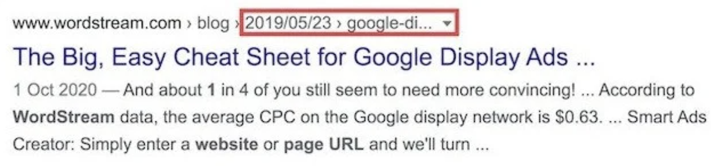
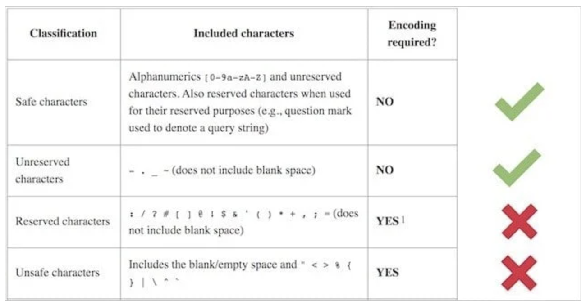
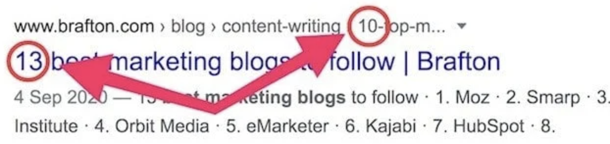

목차는 다음과 같다.

1. slug란 무엇일까?
2. slug가 seo 랭킹에 왜 중요할까?
3. seo에 좋은 slug를 작성하는 방법은 무엇일까?

---

## 1. slug란 무엇일까?

slug란 url에서 마지막 backslash('/') 뒤에 오는 문자열로, 이 문자열을 통해서 현재 보여지는 페이지가 어떤 페이지인지 식별할 수 있고, 유저와 검색 엔진에게 현재 보여지는 페이지가 어떤 정보를 담고있는지를 알려준다.

---

## 2. slug는 SEO 랭킹에 왜 중요할까?

한번쯤 랜덤한 문자와 숫자로 구성된, 읽을 수 없는 URL을 본적이 있지 않은가? 이러한 URL들은 신뢰도가 떨어지고, 혼란을 야기함으로써 유저들은 링크를 공유하지 않게된다. URL이 깔끔하고 깨끗하다면 적어도 링크 공유에 의지가 있는 유저들을 떠나보내진 않았을 것이다.

이는 비단 유저뿐만이 아니라 검색 엔진도 마찬가지다. 검색 엔진 알고리즘 역시도 깔끔하고, 깨끗하고, 데이터를 이해하기에 최적화된 컨텐츠가 필요하다. 잘 작성된 slug는 사이트를 방문하는 유저 뿐만 아니라 검색 엔진이 페이지를 이해하는데 도움을 준다. 그렇다면 seo에 최적화된 slug를 작성하는 법은 무엇일까? 이후에 언급될 방법들을 보면 알겠지만, 대부분이 slug의 가독성을 향상시키는 방법들이다.

---

## 3. seo에 좋은 slug를 작성하는 방법은 무엇일까?

### (1) 최대한 짧게 만들기
이 이야기는 slug를 포함한 URL관점에서 해석해야 한다. 그러니까 URL이 짧으면 짧을수록 좋다. 이는 SEO 뿐만이 아니라 다음과 같은 장점도 누릴 수 있다.

- 유저가 기억하기 쉬워진다.
- SERP에서 짤리지 않게된다.

첫번째는 자명하고, 두번째는 SERP가 무엇인지에 대한 이해가 필요하다. SERP는 Search Engine Results Pages의 줄임말로, 구글과 같은 검색 엔진을 통해서 유저에게 보여지는 페이지들을 의미한다. SERP는 지리적 위치, 검색 기록등을 포함한 다양한 인자를 고려하여 보여지기 때문에 유니크하다. 그리고 SERP가 짤리게 된다면 아래 이미지와 같은 결과가 나오게된다.

[이미지출처](https://seosherpa.com/url-slugs/)

slug를 짧게 만들기 위한 두가지 팁은 다음과 같다

- 중요 키워드만 남긴다. 기존 slug가 SEO-Experiments-That-Changes-SEO-Forever이라면, SEO-Experiments 정도로 키워드만 남길 수 있게된다.
- function words('a', 'of', 'the')나 verb('are', 'have' 등)를 제외한다.

오해하지 말아야 할것은, slug를 가능한 선에서 짧게 만들자는 것이지, 내부에 어떤 컨텐츠가 있는지도 알수 없을 정도로 짧게 만들자는 것은 아니다.

### (2) 안전한 문자, 예약되지 않은 문자 사용하기

안전하지 않은 문자나 예약된 문자를 사용하는 경우, 가독성이 떨어질 뿐만아니라 웹 크롤러의 접근을 막을수도 있다.

[이미지출처](https://seosherpa.com/url-slugs/)

### (3) hyphen 사용하기

만약 키워드를 구분하기 위해서 공백을 넣는다면, 브라우저는 이를 '%20'으로 변형하게하여 어색한 URL을 만든다. 이를 방지하기 위해서 우리는 다음 두가지 선택지를 가질 수 있다.

- hyphen (-)
- underscore (_)

이 중에서 hyphen을 사용하자. 구글 검색 엔진은 hyphen 사용을 권하고 있다. 또한 컴퓨터나 웹크롤러는 hyphen을 공백으로 인식하여 `which-creates-something-that-looks-like-this`를 `whichcreatessomethingthatlookslikethis`로 해석하지만, underscore는 이렇게 해석되는게 불가능하다.

hyphen이 언급된 김에 한가지 더 짚고 넘어가자면, 도메인 이름에 hyphen을 넣지 않는 것이 좋다. 이유는 유저가 기억하기 어렵고, 구두로 말할때도 헷갈릴 수 있기 때문이다. 도메인 이름에 hyphen이 들어가면 SEO에 불리하다는 이야기도 있지만 이는 [본 아티클](https://news.gandi.net/en/2020/08/should-i-put-a-dash-in-my-domain-name/)에서는 미신이라고 언급하고 있다. 다만 hyphen을 통해서 URL이 길어지기 때문에 SEO에 불리할 수는 있다.

### (4) 키워드만 포함하고, 키워드 수식어 붙여주기
키워드만 포함하는 이유는 URL을 짧게 만들자는 취지 뿐만 아니라, 컨텐츠를 업데이트하기 쉽게 만들려는 의도도 존재한다. 만약 기존 slug가 컨텐츠에 대한 너무 많은 정보를 포함한다면, 해당 컨텐츠가 조금만 수정돼도 slug가 영향을 받게 될것이다.

또한 키워드 수식어를 붙여주는 것 역시도 좋다. 키워드 수식어는 slug에 추가적인 정보를 제공하는 단어로, "best", "guide", "checklist", "review"등이 있는데 이는 SEO에 도움을 줄수 있다. 다만, 여기서도 컨텐츠의 정보를 변경하기 힘들게 만드는 "guide", "checklist"등 보다는 "best", "boost"등의 키워드를 사용하는 것이 좋다.

### (5) 제목과 일치시키기
제목과 일치시킴으로써 페이지가 어떤 컨텐츠를 포함하고 있는지를 드러내는 것이다. 물론 slug와 제목이 무조건 일치할 필요는 없다.

가령 'Everything You Need to Know About Content Marketing'의 slug는 'everything-about-content-marketing'정도가 될수있다.

### (6) 날짜를 포함한 숫자 삭제하기
slug에 숫자가 들어가는 경우, 항상 제목과 slug를 일치시켜야 한다는 번거로움이 존재한다. 기존 slug가 다음과 같이 작성돼있다고 가정해보자.

23-SEO-Expriments

만약 여기서 컨텐츠 내용이 수정되어 21개의 SEO Experiments가 된다면 slug 역시도 수정해주어야한다. 만약에 이를 까먹게 된다면 아래 이미지와 같이 SERP에도 잘못된 정보가 표시될 것이다.

[이미지출처](https://seosherpa.com/url-slugs/)

만약 날짜가 들어간다면, 유저 입장에서 컨텐츠가 옛날 컨텐츠처럼 보일수도 있다. 이 글을 읽고 계시는 독자분들은 'valuable-seo-lessons-2012'를 봤을 때 어떤 느낌이 드는지 궁금하다. 나는 만약 이 slug를 보게된다면 굳이 이 게시글에 들어가려고 하지 않을 것 같다.

### (7) 소문자 사용하기
대부분의 모던 웹 서버는 URL에 대해서 case-insenstive, 즉, 대소문자를 구분하지 않는다. 하지만 모든 웹 서버가 그런것은 아니기 때문에, 조심하자는 차원에서 "do or die"전략으로 소문자만 쓰자는 것이다. 만약 대문자와 소문자를 섞어서 사용한다면 404 페이지 에러나 페이지 중복 문제가 발생할 수 있다.

## 📚 참고문헌

[What is a URL Slug & How to Use Them Successfully in Your SEO Strategy?](https://rockcontent.com/blog/what-is-url-slug/)

[Best practices for SEO-friendly URLs](https://yoast.com/seo-friendly-urls/)

[URL Slugs: How to Create SEO-Friendly URLs (10 Easy Steps)](https://seosherpa.com/url-slugs/)

[Dash or Underscore in URL? Here’s How It’s Affecting Your SEO](https://studiohawk.com.au/blog/dash-or-underscore-in-url-heres-how-its-affecting-your-seo/)