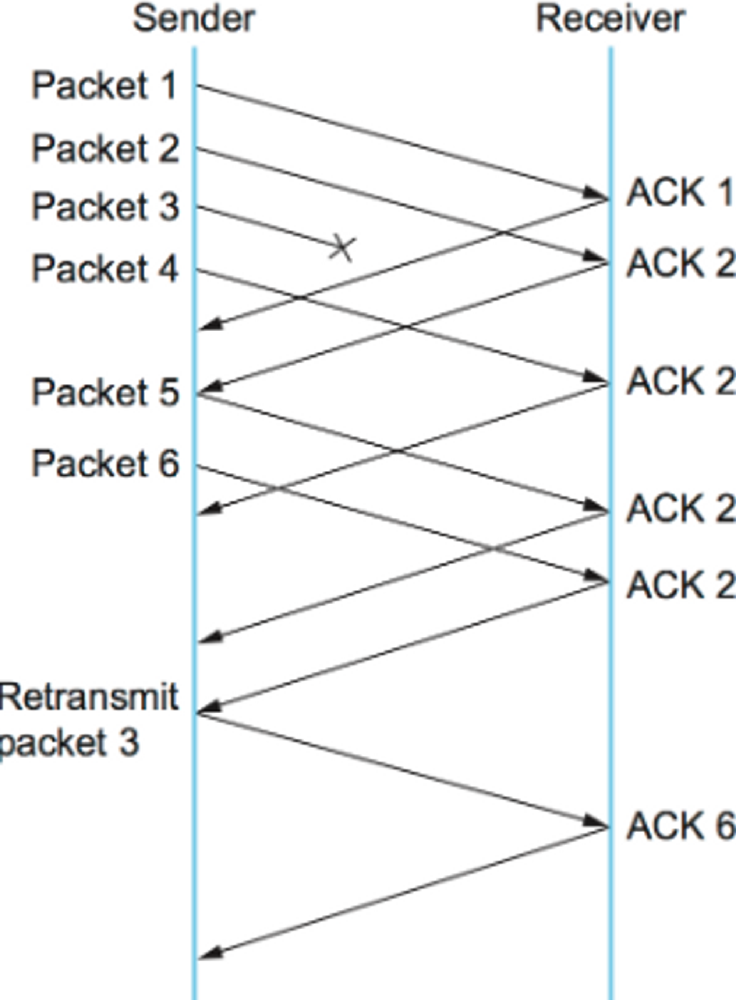
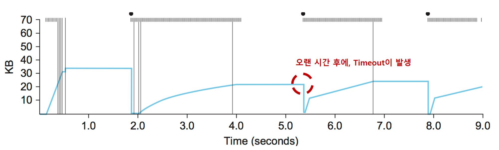
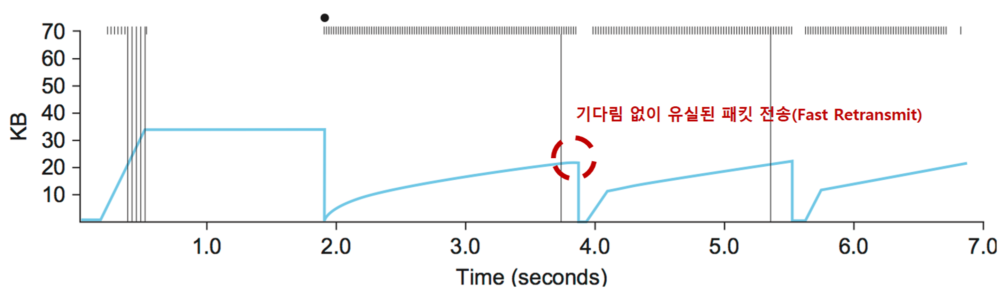
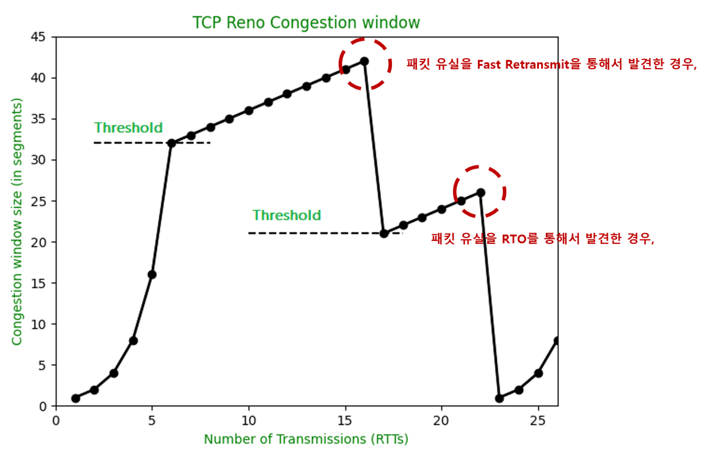
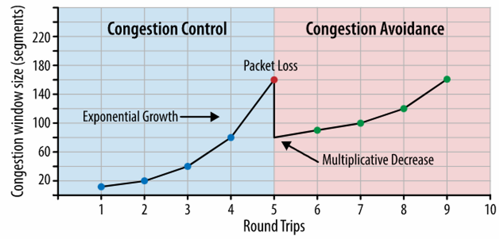
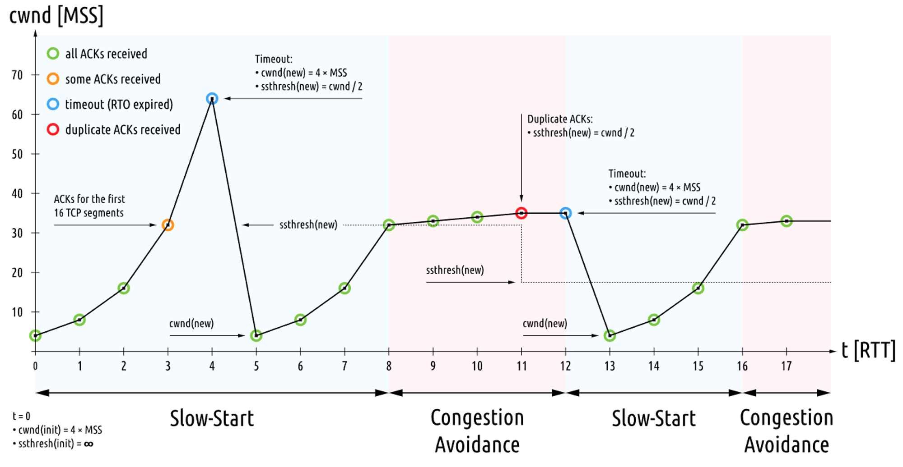
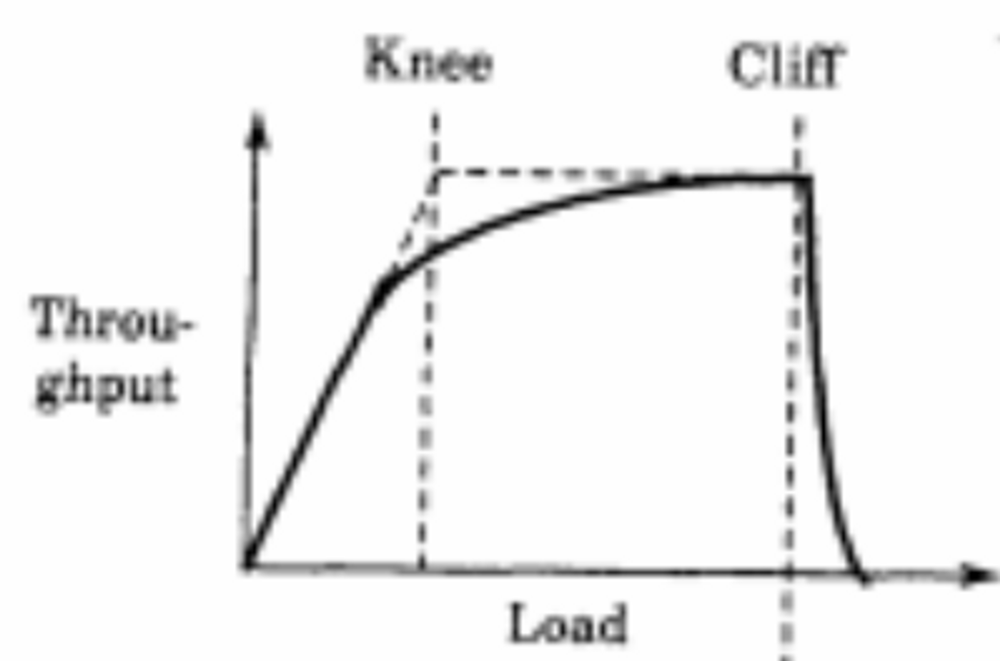
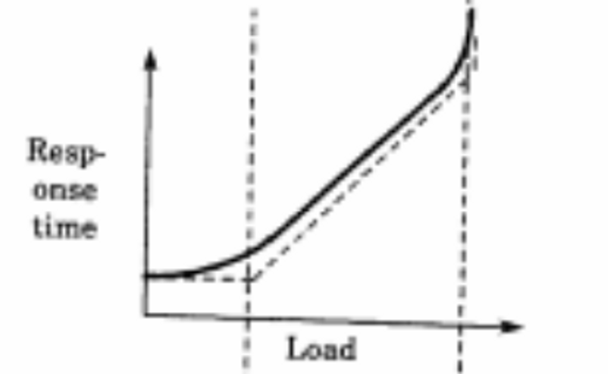
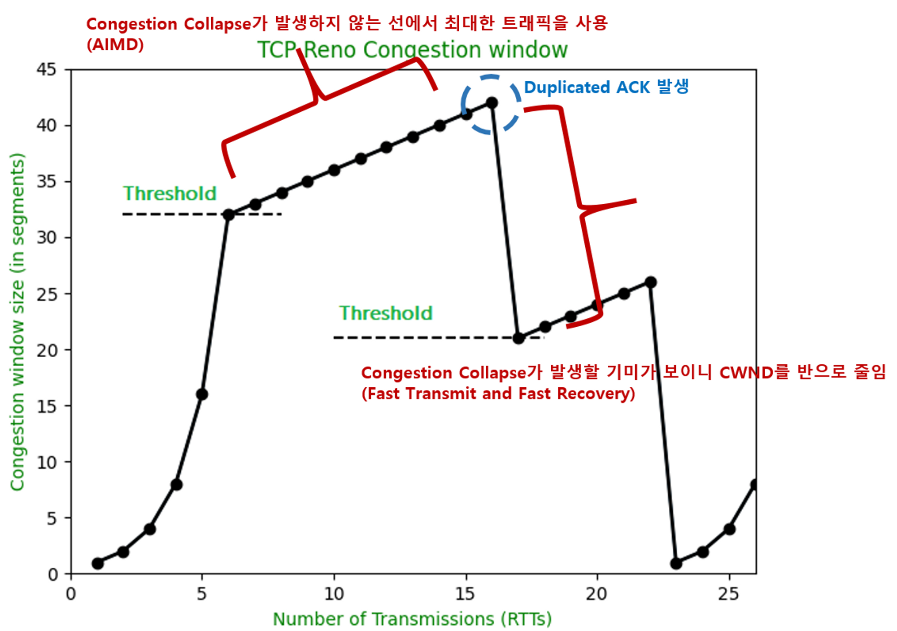
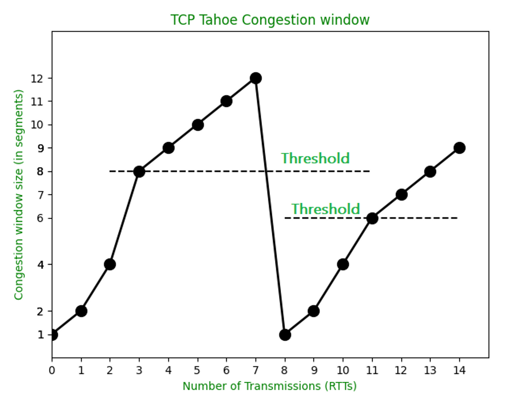

## TCP Control

TCP Control과 관련된 용어 및 기술들을 설명한다

1. CWND(Congestion Window)
2. AIMD와 Slow Start
3. Fast Trasnmit과 Fast Recovery
4. TCP Control과 TCP Avoidance의 차이
5. TCP Tahoe
6. TCP Reno

참고로 여기서 4와 5는 2, 3을 조합한 알고리즘이다.

---

## CWND(Congestion Window)와 RWND(Receiver Window)

TCP에서 작은 크기의 데이터를 포함하는 많은 수의 패킷 전송은 비효율적입니다. 그러므로 패킷을 한번에 보내고 응답을 하나만 받습니다. 최대한 많은 패킷을 한번에 보내는 것이 효율적이지만, 패킷 유실 가능성이 존재하므로, 적절한 송신량 결정이 중요합니다.

송신자가 한번에 보낼 수 있는 패킷의 양을 CWND라 하고, 수신자가 받을 수 있는 패킷의 양을 RWND(Receiver Window)라고 합니다.

CWND와 RWND는 TCP Header에 존재합니다. 수신자는 RWND에 자신이 받을 수 있는 패킷의 크기를 기입하고, 송신자는 이를 기반으로 CWND를 정합니다.

송신량은 CWND에 제한되며, 네트워크가 수용할 상황이 아니라면, RWND보다 CWND가 훨씬 작을 수 있습니다.

---

## AIMD(Addictive Increase Multiplicative Decrease)와 Slow Start

송신자는 패킷을 전송할 때, 네트워크의 상태를 모릅니다. 그러므로 갑작스러운 데이터 전송으로 인한 부하와 혼잡을 방지하기 위해, 다음과 같은 동작을 수행합니다.

1. 송신자는 패킷을 천천히 전송하면서 네트워크를 파악합니다.

2. 수신자는 RWND와 함께 응답합니다.

3. 송신자는 패킷의 양을 늘려서 전송합니다.

4. 수신자로부터 응답을 받지 못하거나 (= Packet Loss Detection || Timeout || Retransmission TimeOut한 경우) RWND에 도달할 때까지 3을 반복합니다.

몇 가지 용어에 대해서 참고삼아 먼저 정의하고 갑니다.

Timeout과 Retransmission Timeout(RTO)은 동일한 뜻으로, 패킷을 보내고 일정 시간 안에 응답을 받지 못하는 것을 의미합니다. 또한 Timeout은 시간 초과를 의미하고, Time out은 휴식 시간을 의미한다는 차이점이 있습니다.
또한 Packet Loss와 Packet Drop은 다른 의미입니다. loss는 도착지에 도착하지 못한 것이고, drop은 라우터등이 의도적으로(패킷이 DOS 어택이라고 판단하는 등) 패킷을 버린 것입니다. drop은 loss의 일종입니다.

다시 돌아와서, 3 과정에서 패킷의 양을 늘려서 전송한다고 적혀있습니다. 패킷의 양을 어떻게 증가시키느냐에 따라서 AIMD와 Slow Start 두가지로 나뉩니다.

첫번째는 AIMD(Addicitve Increase Multiplicative Decrease) 방식입니다. CWND를 1씩 증가시키고, 패킷 유실시 Slow Start Threshold(ssthresh)를 1/2 감소시킵니다. 패킷 유실시 1/2 감소하는 대상은 CWND가 아닌 ssthresh임에 주의합니다.

두번째는 Slow Start 방식입니다. AIMD는 네트워크의 수용 능력에 최대한 가깝게 사용이 가능하지만, 데이터 전송량이 매우 느리게 증가한다는 단점이 있습니다. 그래서 Slow Start가 등장했습니다.

Slow Start는 CWND를 2배씩 증가시킵니다. 초기 Connection시와 패킷 유실시 Slow Start를 사용할 수 있습니다.

AIMD와 Slow Start 모두 패킷 유실시 CWND를 얼마로 낮출 것인가는 상황에 따라서 달라집니다.

---

## Fast Transmit과 Fast Recovery

패킷이 중간에 유실(loss)되어 순서대로 도착하지 못하는 경우 어떻게 될까요? 만약 송신자가 패킷 1, 2, 3, 4, 5, 6 순서대로 보내는데, 3번 패킷이 유실된 경우, 수신자는 ACK 1, 2, , 2, 2, 2를 보내게 됩니다. 즉, 수신자는 마지막으로 받은 패킷을 가리키는 ACK를 계속해서 보냅니다.

여기서 두 번째로 보내는 ACK 2, 즉, ‘중복된’ ACK를 Duplicated ACK라고 합니다. 송신자는 이 Duplicated ACK를 통해서, 수신자가 순서대로 데이터를 못받고 있다는 것, 즉, 앞의 패킷이 유실되었음을 알게됩니다.

혹시나 패킷 유실이 아닌, 지연으로 인해서 늦게 도착할수도 있기 때문에, 송신자는 Retransmit 하기전에 Duplicated ACK를 3번 기다립니다. 아래 사진과 같이 말이죠.

[이미지 출처](https://book.systemsapproach.org/congestion/tcpcc.html)

위 사진에서 놓치지 말아야할 것은, 3번 패킷을 재전송한 후에, 6번 패킷까지 잘 받았다는 ACK 6을 전달한다는 것 입니다.

Fast Reransmit이 어떤 효과가 있는지 그래프를 통해서 한번 알아보겠습니다. 아래 나오는 그래프는 가볍게 보시길 바랍니다.

[이미지 출처](https://book.systemsapproach.org/congestion/tcpcc.html)

그래프 해석에 있어서 필요한 정보만 나열하면 다음과 같습니다

- 상위 그래프는 Fast Retransmit이 적용되지 않음, 하위 그래프는 Fast Retransmit이 적용됨
- 상위의 Dot은 Timeout이 발생한 시점
- 상위의 Hash 마크는 패킷 전송을 의미
- 파란색 라인은 CWND를 의미합니다.
- 수직선은 패킷 유실이 발생한 시점

하위 그래프를 보면, 상위 그래프에 비해, Timeout 대기 시간이 짧고, Timeout 대기 시간에도 패킷을 전송하는 것을 확인할 수 있습니다.

우리는 여기서 패킷 유실과 Timeout의 관계를 짚고 넘어가야 합니다. 상위 그래프의 적색 원을 보면, 패킷 유실이 발생하면 일정 시간 후 Timeout이 발생합니다. 아래 그래프의 적색 원을 보면, 패킷 유실이 발생하면 Timeout 없이 Retransmisstion이 발생합니다.

Timeout이 발생하면 패킷 유실이 발생한게 맞지만, 패킷 유실이 발생하면 Timeout이 발생하는 것은 아닙니다. Fast Retrasnmit에서 설명했듯이, 패킷 유실이 일어났음에도 수신자로부터 응답을 받을 수 있었습니다. 그리고 이 차이를 통해서 Timeout이 발생하는 경우가 Fast Retransmit이 발생하는 경우보다 네트워크 상황이 안좋다는 것을 알 수 있습니다.

여기까지가 Fast Retransmit에 관한 이야기고, Fast Retransmit의 성능을 조금더 향상시키기 위해서 Fast Recovery가 등장합니다. 이는 Slow Start Phase를 건너 뛰는 것 입니다. 아래 Congestion Control 알고리즘 중 하나인 TCP Reno가 좋은 예시입니다.

[이미지 출처](https://www.geeksforgeeks.org/tcp-tahoe-and-tcp-reno/)

즉, CWND 1부터 Slow Start를 적용하는게 아니라, Fast Retransmit으로 패킷 유실을 감지하면 CWND의 절반부터 Addictive Increase를 하는 것 입니다. 결국 Slow Start는 Connection의 시작 단계와 Timeout이 발생했을 때만 사용하게 되는것이죠.

---

## TCP Control과 TCP Avoidance의 차이

Congestion Control과 Congestion Avoidance 용어를 동일하게 사용해도 되는지, 그리고 Congestion Control에 대해 이야기하면서 등장하는 Flow Control은 무엇인지 알아봅시다.

먼저 Congestion Control과 Congestion Avoidance가 동일한가? 결론부터 말하자면 둘은 전혀 다릅니다.

[위키피디아](https://en.wikipedia.org/wiki/TCP_congestion_control#TCP_Tahoe_and_Reno)에서는 ‘TCP 혼잡 회피 알고리즘은 혼잡 제어 알고리즘의 기반이다’라고만 설명할 뿐, 둘을 구분해서 쓰고 있지 않습니다. 이뿐만 아니라 여러 곳에서 그렇습니다. 동일하게 취급해도 되나보네 싶지만, 아래와 같이 종종 등장하는 혼잡 제어 알고리즘을 보면, 동일하게 취급하면 안될것 같습니다. 🙄

[이미지 출처](https://hpbn.co/building-blocks-of-tcp/)

[이미지 출처](https://witestlab.poly.edu/blog/tcp-congestion-control-in-lossy-wireless-networks/)

인터넷에 Congestion Control과 Congestion Avoidance로 검색하면 흔히 나오는 그래프 두장입니다.

위 그래프는 Congestion Control과 Congestion Avoidance를 명백하게 구분지어 놓았고, 아래 그래프는 Slow Start와 Congestion Avoidnace로 구분지어 놓았습니다. 보통 아래와 같이 Phase 명을 Slow Start와 Congestion Avoidance로 명명하고, Congestion Avoidance Phase에 Linear하게 증가하는 그래프가 더 많이 보입니다.

혼란이 가중되던 중, Congestion Control과 Congestion Avoidance 의미를 다르게 규정하는 논문을 발견했습니다. (“CONGESTION AVOIDANCE IN COMPUTER NETWORKS WITH A CONNECTIONLESS NETWORK LAYER PART I: CONCEPTS, GOALS AND METHODOLOGY”, Ra j Jain, K. K. Ramakrishnan Digital Equipment Corporation)

논문에서 설명하는 내용은 아래와 같습니다.

먼저 위 그래프를 이해해야 합니다. Load(네트워크 부하)가 낮을 때는 Throughput이 Linear하게 증가합니다. 그러다가 Load가 네트워크 Capacity보다 커지는 경우, Throughput이 0이 됩니다. 이때를 혼잡 붕괴(Congestion collapse)라고 합니다.

그래프의 수직선을 보겠습니다. Throughput이 급격하게 떨어지기 시작하는 지점을 Cliff라고하고, Throughput이 천천히 증가하기 시작하는 지점을 Knee라고 합니다. Knee 근방에서 트래픽을 사용하는 전략을 Congestion Avoidance라고 하고, Cliff를 넘지않게 트래픽을 사용하는 전략을 Congestion Control이라고 합니다.

다음과 같이 Response Time과 Load의 관계로도 볼 수 있습니다.

Congestion Avoidance는 유저가 Response Time에 심각하게 영향을 주지 않을만큼 트래픽을 사용하는 전략입니다. 우연히 영향을 받게 되는 경우, Congestion Control을 통해서 Cliff의 왼쪽구간에서 동작하게 만들어 줍니다. Congestion Control은 ‘회복하는 과정’과 같고, Congestion Avoidance는 ‘예방하는 과정’과 같다고합니다.

다시 종합해보면, Congestion Avoidance는 Congestion Collapse가 발생하지 않는 선에서 트래픽을 최대한 사용하는 알고리즘이고, Congestion Control은 Congestion Collapse가 발생하는 상황을 막는 알고리즘입니다. 아래 추후에 언급하는 TCP Reno를 통해서 대입해보면, 어느정도 들어맞는 것 같습니다.

---

## TCP Tahoe

참고로 Tahoe는 USA의 한 호수입니다. 이 기술이 이 호수 근처에서 발명되어 TCP Tahoe라는 이름이 붙게되었습니다. 이후에 등장하는 Reno는 도시 이름입니다.

TCP Tahoe는 아래와 같이 구성됩니다

> TCP Tahoe = Slow Start + AIMD + Fast Transmit
> 동작은 아래와 같습니다.

[이미지 출처](https://www.geeksforgeeks.org/tcp-tahoe-and-tcp-reno/)

1. Slow Start Phase

   Slow Start Threshold(ssthresh)에 도달하기 전까지 slow start 알고리즘이 적용됩니다. 그래프에는 안나와있지만 초기 ssthresh는 infinite입니다. 이후, 패킷 유실에 따라서 ssthresh 값을 조정합니다. ssthresh에 도달하면, AIMD 알고리즘이 적용됩니다.

2. AIMD Phase

   AIMD에서 이야기했던 대로, CWND를 1씩 증가시키다가, Timeout이 발생하면 CWND를 1로 초기화시키고, ssthresh를 50% 감소시킵니다. CWND가 50% 감소하는게 아니라, ssthresh가 50%감소하는 것에 다시 주의합니다.

패킷 유실은 RTO나 Fast Retrasnmit에 의해 감지되며, 둘 모두 CWND를 1로 만들고, ssthresh를 이전 CWND의 1/2로 만듭니다.

---

## TCP Reno

TCP Tahoe에 Fast Recovery가 추가된 전략입니다.

> TCP Reno = TCP Tahoe + Fast Recovery

[이미지출처](https://www.geeksforgeeks.org/tcp-tahoe-and-tcp-reno/)

패킷 유실을 어떻게 발견했느냐에 따라서 동작이 달라집니다.

패킷 유실을 Fast Transmit을 통해서 발견하게 되는 경우, Fast Recovery를 통해서 CWND와 ssthresh를 이전 CWND의 1/2 수준으로 줄입니다.

패킷 유실을 RTO를 통해서 발견하게 되는 경우, CWND를 1로, ssthresh를 이전 CWND의 1/2수준으로 줄입니다.

[이미지 출처](https://www.geeksforgeeks.org/tcp-tahoe-and-tcp-reno/)

## 📚 참고 문헌

[packet drop vs packet loss](https://security.stackexchange.com/questions/13372/what-is-packet-drop-packet-loss-and-how-packet-drop-attack-works)

[TCP congestion control from wikipedia](https://en.wikipedia.org/wiki/TCP_congestion_control)

[TCP Congestion Control from systemapproach](https://book.systemsapproach.org/congestion/tcpcc.html)

[End-to-end principle](https://en.wikipedia.org/wiki/End-to-end_principle)

[What Is TCP Slow Start](https://www.keycdn.com/support/tcp-slow-start)

[WHAT IS CWND AND RWND?](https://blog.stackpath.com/glossary-cwnd-and-rwnd/)

[TCP Tahoe and TCP Reno](https://www.geeksforgeeks.org/tcp-tahoe-and-tcp-reno/)

[TCP RTOs: Retransmission Timeouts & Application Performance Degradation](https://www.extrahop.com/company/blog/2016/retransmission-timeouts-rtos-application-performance-degradation/)

[“IT 엔지니어를 위한 네트워크 입문” 고재성, 이상훈 지음](https://product.kyobobook.co.kr/detail/S000001834493)
