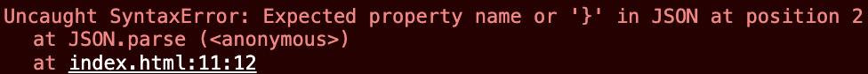
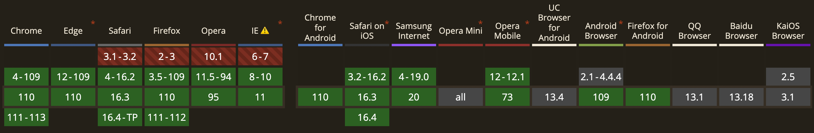
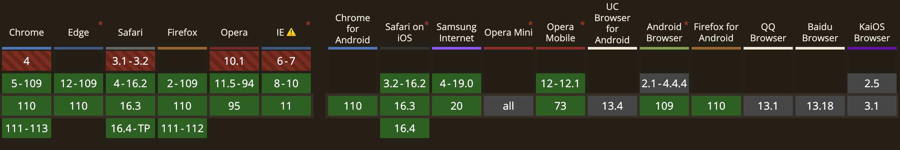

본인이 프로그래머스 데브코스를 수강할 때 바닐라 자바스크립트 멘토님께서 localStorage를 다음과 같이 사용하셨다.

```javascript
const storage = window.localStorage;

const getItem = (key, fallbackValue) => {
  try {
    const res = storage.getItem(key);

    return res ? JSON.parse(res) : fallbackValue;
  } catch (e) {
    console.error(e.message);
    return fallbackValue;
  }
};

export default {
  getItem,
  setItem,
};
```

위 코드의 getItem 내부에서 왜 try ~ catch 문을 써야하는지다. 당시에 워낙 수업 따라가기도 힘들었어서 제대로 짚고 넘어가지 못한 부분이었는데, 하필 강사님이 계신 회사에 면접을 보러갔을 때 강사님께서 왜 저렇게 작성한건지 알고 있냐고 물어보셨었다. 그 당시에 강사님께서 이유를 알려주셨었는데, 이번에 데브매칭 시험을 공부하면서 이유를 까먹어 다시 찾아보았다.

우선 강사님이 알려주신 이유와 별개로 한가지 이유가 더 존재하는데 다음과 같다.

1. JSON.parse시 발생할 수 있는 에러
2. localStorage가 지원되지 않는 환경에서 발생하는 에러

1은 다음과 같다. storage에 저장할 때는 JSON.stringify를 이용해서 저장하는데 어떤 경유로 `{ a : 1` 이라는 객체가 저장됐다고 가정해보자. 그리고 이 객체를 다시 가져와서 JSON.parse 하려고 할때 다음과 같은 에러가 발생하게 된다.



에러가 의미하는대로, 두번째 프로퍼티(at position2)가 와야하는데 생략이 되었거나, 두번째 프로퍼티가 오지는 않는데 `}`를 기입하지 않아서 발생하는 에러다. 만약 아래와 같이 try ~ catch를 사용하지 않고 코드를 작성하면 프로그램이 멈출수도 있기 때문에 catch 문에서 에러를 포착하여 fallbackValue를 내놓는 것이다.

```javascript
const res = JSON.parse(localStorage.getItem(2)); // 에러 발생
console.log(res); // 실행되지 않음
```

2는 다음과 같다. 우선 [Can i use?](https://caniuse.com/)를 통해 localStorage와 sessionStorage가 어떤 브라우저에서 지원되지 않는지 찾아봤다.

localStorage는 다음과 같다.
;

sessionStorage는 다음과 같다.
;

그렇다면 지원이 안되는 상황에서 코드가 작동하도록 하기 위해서는 어떻게 작성해야 할까? [How to Use LocalStorage Safely](https://javascript.plainenglish.io/how-to-use-localstorage-safely-a96eb50fbb4e)에서는 다음과 같이 사용하는 것을 제시하고 있다.

```javascript
function isSupportLS() {
  try {
    localStorage.setItem('_ranger-test-key', 'hi');
    localStorage.getItem('_ranger-test-key');
    localStorage.removeItem('_ranger-test-key');
    return true;
  } catch (e) {
    return false;
  }
}

class Memory {
  constructor() {
    this.cache = {};
  }
  setItem(cacheKey, data) {
    this.cache[cacheKey] = data;
  }
  getItem(cacheKey) {
    return this.cache[cacheKey];
  }
  removeItem(cacheKey) {
    this.cache[cacheKey] = undefined;
  }
}

export const storage = isSupportLS() ? window.localStorage : new Memory();
```

그러니까 isSupportLS 함수를 실행하여 에러가 발생하면 브라우저 저장소가 아닌 웹사이트 내부의 Memory에 저장하는 방법을 제시하고 있다. 하지만 [Javascript Try Catch for Localstorage Detection](https://stackoverflow.com/questions/14154478/javascript-try-catch-for-localstorage-detection)에서 isSupportLS 보다 더 간단하게, 그리고 Edge case까지 고려하여 작성하는 방법을 제시하고 있다.

```javascript
function supports_html5_storage() {
  try {
    return 'localStorage' in window && window['localStorage'] !== null;
  } catch (e) {
    return false;
  }
}
```

해당 게시글을 들어가면 알겠지만, 위 함수에서 try ~ catch 문을 사용하는 이유는 오래된 Firefox는 쿠키 사용을 꺼놨을 때 예외가 발생할 수 있는 버그가 있다고 한다.

그러므로 코드를 다음과 같이 완성할 수 있게된다.

```javascript
function supports_html5_storage() {
  try {
    return 'localStorage' in window && window['localStorage'] !== null;
  } catch (e) {
    return false;
  }
}

class Memory {
  constructor() {
    this.cache = {};
  }
  setItem(cacheKey, data) {
    this.cache[cacheKey] = data;
  }
  getItem(cacheKey) {
    return this.cache[cacheKey];
  }
  removeItem(cacheKey) {
    this.cache[cacheKey] = undefined;
  }
}

export const storage = supports_html5_storage()
  ? window.localStorage
  : new Memory();
```