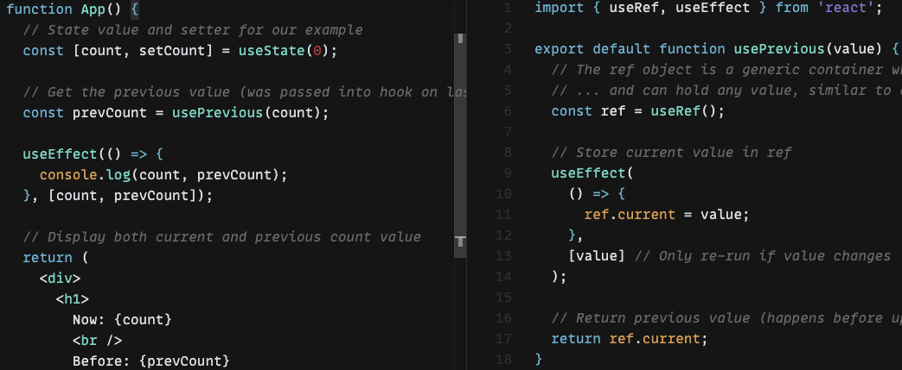

작업을 하면서 아래 코드의 동작이 잘 이해가 안갔다.


[코드 출처](https://codesandbox.io/s/pwnl6v7z6m)

App 컴포넌트 내의 useEffect 내부에서 count와 prevCount를 비교하면 prevCount가 항상 이전값을 보여준다. 대부분의 사람들의 경우 너무나 당연하게 이해할 수 있었을지 모르겠지만, 불행하게도 나는 아니었다. 내가 생각한 것은 다음과 같다. useEffect는 렌더링이 된 후에 실행된다. 그러므로 ref.current가 이후의 값으로 바뀌는 것도 렌더링이 된 후이다. 더불어서 App 컴포넌트 내의 useEffect 내의 prevCount는 이미 값이 바뀌어 있으므로 log에서 count와 prevCount가 같은 값을 가져야한다. 하지만 그렇지 않다.

답은 너무나 간단하게도 다음 문에 있다.

```javascript
const prevCount = usePrevious(count);
```

그러니까 이전 값을 prevCount라는 변수에 저장하고, ref라는 참조값에 접근하지 않기 때문에 항상 이전값을 보여줄 수 있는 것이다.

---
## usePrevious 강화하기

본 목차는 [Implementing advanced usePrevious hook with React useRef](https://www.developerway.com/posts/implementing-advanced-use-previous-hook)의 내용을 정리했다. usePrevious 코드를 구글링해보면 일반적으로 다음과 같이 작성된 코드를 볼수있다.

```javascript
const usePrevious = value => {
  const ref = useRef();

  useEffect(() => {
    ref.current = value;
  });

  return ref.current;
};
```

그런데 이 훅은 한가지 문제점을 안고있다. value가 바뀌지 않았음에도 불구하고, 다른 상태에 의해서 리렌더링이 발생하면 value와 ref.current가 동일해지는 순간이 올수 있다는 것이다. 예를들면 다음과 같이 코드가 작성돼있다고 가정해보자.

```javascript
function App() {
  const [count, setCount] = useState(0);
  const [_, forceRerender] = useState({});

  const prevCount = usePrevious(count);

  useEffect(() => {
    console.log(count, prevCount);
  }, [count, prevCount]);

  return (
    <div>
      <button onClick={() => forceRerender({})}>force rerender</button>
      <button onClick={() => setCount(count + 1)}>Increment</button>
    </div>
  );
}
```

만약 Increment 버튼을 네번 누르면 useEffect 내의 log는 순서대로 3과 2를 찍을 것이다. 헌데 만약 force rerender 버튼에 의해서 리렌더링이 발생하는 경우, log는 순서대로 3과 3을 찍게된다. count의 상태가 변하지 않았음에도 prevCount의 값이 변하는 것이다.

이러한 문제를 해결하기 위해서 usePrevious를 다음과 같이 수정할 수 있다. 이 경우 prev 상태를 애초에 들고 있으므로, 렌더링이 된 후에 prev 값을 변경하려고 useEffect를 굳이 사용하지 않아도 된다.

```javascript
export const usePreviousPersistent = <TValue extends unknown>(
  value: TValue
) => {
  const ref = useRef<{ value: TValue; prev: TValue | null }>({
    value: value,
    prev: null
  });

  const current = ref.current.value;

  if (value !== current) {
    ref.current = {
      value: value,
      prev: current
    };
  }

  return ref.current.prev;
};
```

만약 객체를 비교해야 하는 경우 deep equality를 사용해야 하지만 글쓴이는 라이브러리에 따라서 속도가 느릴 수 있어서 별로 선호하지 않는다고 한다. 그래서 matcher 함수를 전달하는 다음 방식을 제안하고 있다.

```javascript
export const usePreviousPersistentWithMatcher = <TValue extends unknown>(
  value: TValue,
  isEqualFunc: (prev: TValue, next: TValue) => boolean
) => {
  const ref = useRef<{ value: TValue; prev: TValue | null }>({
    value: value,
    prev: null
  });

  const current = ref.current.value;

  if (isEqualFunc ? !isEqualFunc(current, value) : value !== current) {
    ref.current = {
      value: value,
      prev: current
    };
  }

  return ref.current.prev;
};
```

